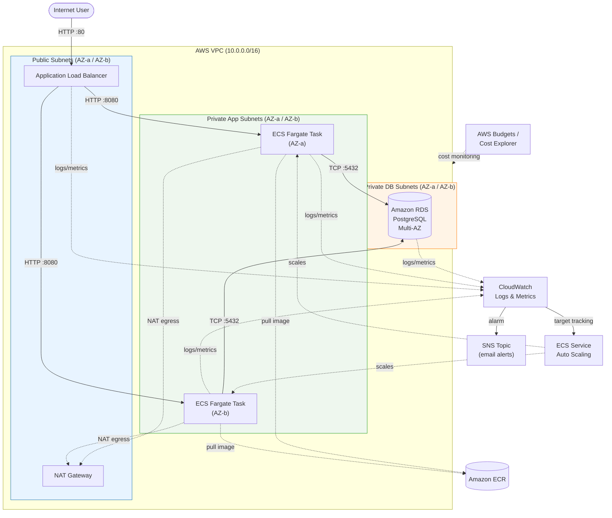
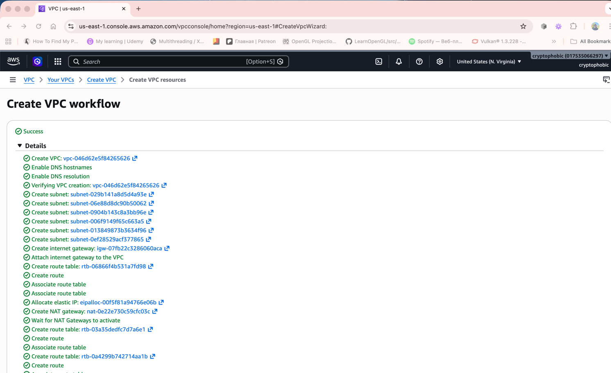
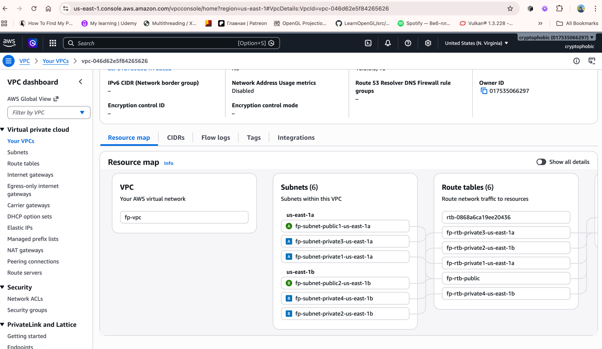
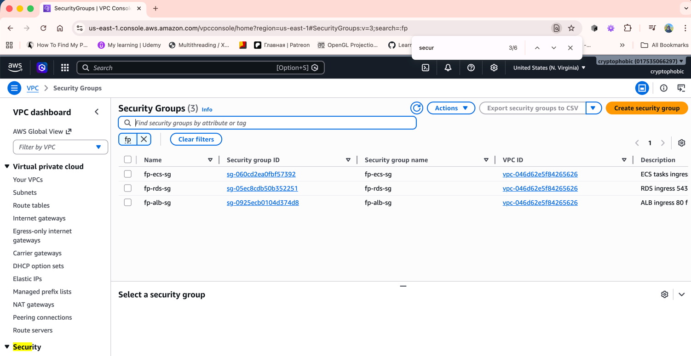
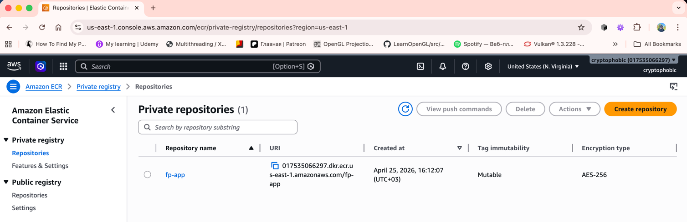
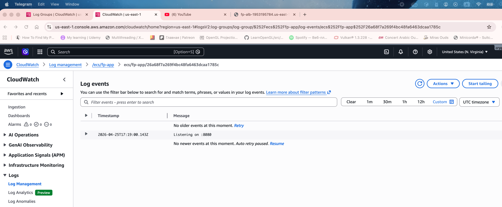
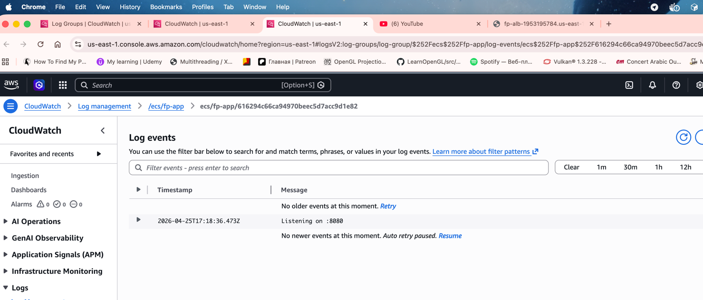
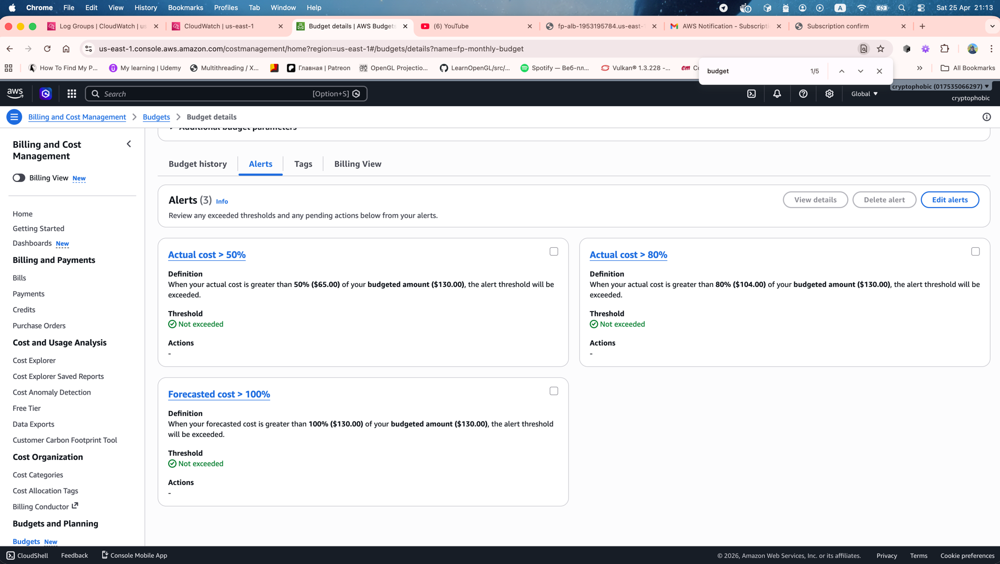
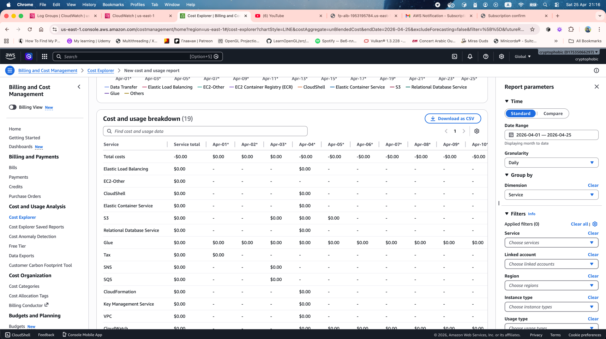

# Фінальний проєкт

## 1. Розробіть архітектуру вашого рішення

 - Намалюйте схему, яка показує, як різні сервіси AWS взаємодіють між собою.

 - Визначте, який стек технологій буде використовуватися. Обґрунтуйте свій вибір.

| Вимога TASK.md | Рішення | Обґрунтування |
|---|---|---|
| Середовище розгортання | ECS Fargate | Менше операційних витрат ніж EC2/EKS, простіше за Beanstalk для контейнерів |
| VPC + підмережі | 3 рівні підмереж × 2 AZ | Публічні для ALB/NAT, приватні для ECS, ізольовані для RDS |
| Security Groups | ALB-SG → ECS-SG → RDS-SG | Ланцюгові правила: ALB приймає 80 з інтернету, ECS приймає 8080 від ALB-SG, RDS приймає 5432 від ECS-SG |
| IAM | Task Execution Role + Task Role | Перша — pull з ECR + логи в CW; друга — доступ застосунку до AWS API |
| База даних | RDS PostgreSQL (Multi-AZ) | Реляційні дані; Multi-AZ для відмовостійкості; пароль у Secrets Manager |
| Моніторинг | CloudWatch + SNS | Метрики CPU/Memory/HTTP 5xx → SNS email alerts |
| Auto Scaling | ECS Service Auto Scaling (target tracking по CPU 60%) | Простіше за step scaling, достатньо для демо |
| Балансувальник | ALB | HTTP/HTTPS, path-based routing, health checks |
| Оптимізація вартості | Budgets + Cost Explorer | Бюджет з email-сповіщенням при 80% / 100% |

## 2. Розгорніть інфраструктуру в AWS

 - Використовуйте AWS Console для створення ресурсів.

**Загальні параметри проєкту:**

| Параметр | Значення |
|---|---|
| AWS Account ID | `017535066297` |
| Region | `us-east-1` |
| IAM principal | `arn:aws:iam::017535066297:user/Dmytro` |
| Resource prefix | `fp` |

### 2.1 VPC — мережева інфраструктура

Створюємо ізольовану мережу для всіх ресурсів проєкту: 1 VPC, 6 підмереж (по 2 на AZ × 3 рівні), Internet Gateway, NAT Gateway та route tables. Використовуємо AWS Console wizard **VPC and more**, який створює всі компоненти атомарно і дає наочний Resource Map для скріншоту.

**Параметри для wizard'а:**

| Поле | Значення |
|---|---|
| **Resources to create** | `VPC and more` |
| **Auto-generate name tag** | `fp` (префікс для всіх ресурсів) |
| **IPv4 CIDR block** | `10.0.0.0/16` |
| **IPv6 CIDR block** | No IPv6 CIDR block |
| **Tenancy** | Default |
| **Number of Availability Zones** | `2` (us-east-1a, us-east-1b) |
| **Number of public subnets** | `2` (по одній на AZ) |
| **Number of private subnets** | `4` (по 2 на AZ → app + db рівні) |
| **NAT gateways** | `In 1 AZ` (один NAT для економії) |
| **VPC endpoints** | `None` |
| **DNS options** | ✅ Enable DNS hostnames, ✅ Enable DNS resolution |

**Кроки в Console:**

1. AWS Console → **VPC** → ліва панель **Your VPCs** → кнопка **Create VPC** (праворуч угорі).
2. Вгорі вибрати радіо-кнопку **VPC and more** (не "VPC only").
3. Заповнити поля за таблицею вище.
4. Праворуч у Preview-панелі переконатись, що показано:
   - 1 VPC
   - 6 subnets (2 public + 4 private)
   - 1 internet gateway
   - 1 NAT gateway
   - 3 route tables (1 public + 2 private — для app і db рівнів wizard створює спільний)
5. Натиснути **Create VPC** внизу. Wizard виконується ~1–2 хв (NAT Gateway provisioning є найдовшою операцією).

6. Після завершення → відкрити створену VPC `fp-vpc` → вкладка **Resource map**.


**Перейменування підмереж** (wizard називає їх `fp-subnet-private1-us-east-1a` тощо — приведемо до відповідності діаграмі):

VPC → Subnets → для кожної з 4 приватних підмереж: Actions → Edit subnet name. Цільова схема:

| Wizard name (приблизно) | Перейменувати на | AZ |
|---|---|---|
| `fp-subnet-public1-us-east-1a` | `fp-public-1a` | us-east-1a |
| `fp-subnet-public2-us-east-1b` | `fp-public-1b` | us-east-1b |
| `fp-subnet-private1-us-east-1a` | `fp-private-app-1a` | us-east-1a |
| `fp-subnet-private2-us-east-1b` | `fp-private-app-1b` | us-east-1b |
| `fp-subnet-private3-us-east-1a` | `fp-private-db-1a` | us-east-1a |
| `fp-subnet-private4-us-east-1b` | `fp-private-db-1b` | us-east-1b |


**Перевірка через CLI:**

```bash
# 1. VPC створено і має правильний CIDR
cryptophobic@Dmitros-MBP FP % aws ec2 describe-vpcs --region us-east-1 \
  --filters 'Name=tag:Name,Values=fp-vpc' \
  --query 'Vpcs[*].[VpcId,CidrBlock,State,Tags[?Key==`Name`].Value|[0]]' \
  --output table

-----------------------------------------------------------------
|                         DescribeVpcs                          |
+------------------------+--------------+------------+----------+
|  vpc-046d62e5f84265626 |  10.0.0.0/16 |  available |  fp-vpc  |
+------------------------+--------------+------------+----------+

# Зберігаємо VPC_ID у змінну для подальших команд (вкладений subshell без --region
# поверне None, якщо default region у CLI відрізняється від us-east-1).
cryptophobic@Dmitros-MBP FP %   VPC_ID=$(aws ec2 describe-vpcs --region us-east-1 \
    --filters 'Name=tag:Name,Values=fp-vpc' \
    --query 'Vpcs[0].VpcId' --output text)
cryptophobic@Dmitros-MBP FP %   echo "VPC_ID=$VPC_ID"                    

VPC_ID=vpc-046d62e5f84265626

# 2. 6 підмереж із правильними AZ та CIDR
cryptophobic@Dmitros-MBP FP % aws ec2 describe-subnets --region us-east-1 \
  --filters "Name=vpc-id,Values=$VPC_ID" \
  --query 'Subnets[*].[Tags[?Key==`Name`]|[0].Value,AvailabilityZone,CidrBlock,MapPublicIpOnLaunch]' \
  --output table

---------------------------------------------------------------
|                       DescribeSubnets                       |
+--------------------+-------------+-----------------+--------+
|  fp-private-db-1a  |  us-east-1a |  10.0.160.0/20  |  False |
|  fp-private-app-1a |  us-east-1a |  10.0.128.0/20  |  False |
|  fp-private-db-1b  |  us-east-1b |  10.0.176.0/20  |  False |
|  fp-public-1a      |  us-east-1a |  10.0.0.0/20    |  False |
|  fp-private-app-1b |  us-east-1b |  10.0.144.0/20  |  False |
|  fp-public-1b      |  us-east-1b |  10.0.16.0/20   |  False |
+--------------------+-------------+-----------------+--------+

# 3. Internet Gateway підключений до VPC (фільтруємо по vpc-id, надійніше за тег)
aws ec2 describe-internet-gateways --region us-east-1 \
  --filters "Name=attachment.vpc-id,Values=$VPC_ID" \
  --query 'InternetGateways[*].[InternetGatewayId,Attachments[0].State,Attachments[0].VpcId]' \
  --output table

# 4. NAT Gateway у public subnet, стан available
cryptophobic@Dmitros-MBP FP % aws ec2 describe-internet-gateways --region us-east-1 \
  --filters "Name=attachment.vpc-id,Values=$VPC_ID" \
  --query 'InternetGateways[*].[InternetGatewayId,Attachments[0].State,Attachments[0].VpcId]' \
  --output table

-----------------------------------------------------------------
|                   DescribeInternetGateways                    |
+------------------------+------------+-------------------------+
|  igw-07fb22c3286060aca |  available |  vpc-046d62e5f84265626  |
+------------------------+------------+-------------------------+

# 5. Route tables: public → IGW, private → NAT.
# GatewayId і NatGatewayId винесено в окремі скалярні колонки —
# в одному route записаний тільки один із них, інший буде None.
ryptophobic@Dmitros-MBP FP % aws ec2 describe-route-tables --region us-east-1 \
  --filters "Name=vpc-id,Values=$VPC_ID" \
  --query 'RouteTables[*].[Tags[?Key==`Name`]|[0].Value, Routes[?DestinationCidrBlock==`0.0.0.0/0`].GatewayId|[0], Routes[?DestinationCidrBlock==`0.0.0.0/0`].NatGatewayId|[0]]' \
  --output table

----------------------------------------------------------------------------------
|                               DescribeRouteTables                              |
+----------------------------+-------------------------+-------------------------+
|  None                      |  None                   |  None                   |
|  fp-rtb-private3-us-east-1a|  None                   |  nat-0e22e730c59cfc03c  |
|  fp-rtb-private2-us-east-1b|  None                   |  nat-0e22e730c59cfc03c  |
|  fp-rtb-private1-us-east-1a|  None                   |  nat-0e22e730c59cfc03c  |
|  fp-rtb-public             |  igw-07fb22c3286060aca  |  None                   |
|  fp-rtb-private4-us-east-1b|  None                   |  nat-0e22e730c59cfc03c  |
+----------------------------+-------------------------+-------------------------+
```

> **Прим. про вартість:** NAT Gateway починає тарифікуватись з моменту переходу в `available` (≈$0.045/год + $0.045/GB трафіку). На AWS Free Plan покривається кредитами; після проєкту обов'язково видалити (інакше з'їсть ~$33/міс).

> **Якщо створення VPC падає з `UnauthorizedOperation`:** до IAM користувача `Dmytro` потрібно прикріпити політику `AmazonVPCFullAccess` (Console → IAM → Users → Dmytro → Add permissions → Attach policies directly).

### 2.2 Security Groups та IAM Roles

Конфігуруємо два рівні безпеки:
- **Security Groups** — мережеві правила (порти + джерела) на рівні ENI.
- **IAM Roles** — дозволи на AWS API (ECR pull, CloudWatch Logs тощо), які приймає ECS Task.

#### 2.2.1 Security Groups

Створюємо ланцюг із 3 SG за принципом найменших привілеїв (кожна наступна приймає тільки від попередньої):

| SG | Inbound rule | Source |
|---|---|---|
| `fp-alb-sg` | TCP 80 | `0.0.0.0/0` (інтернет) |
| `fp-ecs-sg` | TCP 8080 | `fp-alb-sg` (тільки ALB) |
| `fp-rds-sg` | TCP 5432 | `fp-ecs-sg` (тільки ECS) |

> **Передумова:** змінна `$VPC_ID` має бути встановлена в shell. Якщо термінал перезапускався, виконати спочатку:
> ```bash
> export VPC_ID=$(aws ec2 describe-vpcs --region us-east-1 \
>   --filters 'Name=tag:Name,Values=fp-vpc' \
>   --query 'Vpcs[0].VpcId' --output text)
> ```

**Команда 1.** Створення `fp-alb-sg` + дозвіл TCP/80 з інтернету:

**Що робить:** створює SG для Application Load Balancer і відкриває HTTP-порт 80 для всього інтернету (це публічний вхід застосунку).

```bash
cryptophobic@Dmitros-MBP FP % aws ec2 create-security-group --region us-east-1 \
  --group-name fp-alb-sg \
  --description "ALB ingress 80 from internet" \
  --vpc-id $VPC_ID \
  --tag-specifications 'ResourceType=security-group,Tags=[{Key=Name,Value=fp-alb-sg}]'

{
    "GroupId": "sg-0925ecb0104d374d8",
    "Tags": [
        {
            "Key": "Name",
            "Value": "fp-alb-sg"
        }
    ],
    "SecurityGroupArn": "arn:aws:ec2:us-east-1:017535066297:security-group/sg-0925ecb0104d374d8"
}

cryptophobic@Dmitros-MBP FP % ALB_SG=$(aws ec2 describe-security-groups --region us-east-1 \
  --filters "Name=vpc-id,Values=$VPC_ID" "Name=group-name,Values=fp-alb-sg" \
  --query 'SecurityGroups[0].GroupId' --output text)

cryptophobic@Dmitros-MBP FP % echo "ALB_SG=$ALB_SG"

ALB_SG=sg-0925ecb0104d374d8

cryptophobic@Dmitros-MBP FP % aws ec2 authorize-security-group-ingress --region us-east-1 \
  --group-id $ALB_SG \
  --protocol tcp --port 80 --cidr 0.0.0.0/0

{
    "Return": true,
    "SecurityGroupRules": [
        {
            "SecurityGroupRuleId": "sgr-01aa1222e2b78c966",
            "GroupId": "sg-0925ecb0104d374d8",
            "GroupOwnerId": "017535066297",
            "IsEgress": false,
            "IpProtocol": "tcp",
            "FromPort": 80,
            "ToPort": 80,
            "CidrIpv4": "0.0.0.0/0",
            "SecurityGroupRuleArn": "arn:aws:ec2:us-east-1:017535066297:security-group-rule/sgr-01aa1222e2b78c966"
        }
    ]
}
```

**Команда 2.** Створення `fp-ecs-sg` + дозвіл TCP/8080 з ALB SG:
 
**Що робить:** створює SG для ECS-задач, відкриває порт 8080 (порт застосунку) тільки для трафіку з `fp-alb-sg`. Жоден інший ресурс у VPC не може досягти ECS напряму.

**Прим.:** використовуємо `--ip-permissions` (а не `--source-group`), бо джерело — інша SG, а не CIDR. Формат: `IpProtocol=tcp,FromPort=...,ToPort=...,UserIdGroupPairs=[{GroupId=...}]`.

```bash
cryptophobic@Dmitros-MBP FP % aws ec2 create-security-group --region us-east-1 \
  --group-name fp-ecs-sg \
  --description "ECS tasks ingress 8080 from ALB SG" \
  --vpc-id $VPC_ID \
  --tag-specifications 'ResourceType=security-group,Tags=[{Key=Name,Value=fp-ecs-sg}]'

{
    "GroupId": "sg-060cd2ea0fbf57392",
    "Tags": [
        {
            "Key": "Name",
            "Value": "fp-ecs-sg"
        }
    ],
    "SecurityGroupArn": "arn:aws:ec2:us-east-1:017535066297:security-group/sg-060cd2ea0fbf57392"
}

cryptophobic@Dmitros-MBP FP % ECS_SG=$(aws ec2 describe-security-groups --region us-east-1 \
  --filters "Name=vpc-id,Values=$VPC_ID" "Name=group-name,Values=fp-ecs-sg" \
  --query 'SecurityGroups[0].GroupId' --output text)

cryptophobic@Dmitros-MBP FP % echo "ECS_SG=$ECS_SG"

ECS_SG=sg-060cd2ea0fbf57392

cryptophobic@Dmitros-MBP FP % aws ec2 authorize-security-group-ingress --region us-east-1 \
  --group-id $ECS_SG \
  --ip-permissions "IpProtocol=tcp,FromPort=8080,ToPort=8080,UserIdGroupPairs=[{GroupId=$ALB_SG}]"

{
    "Return": true,
    "SecurityGroupRules": [
        {
            "SecurityGroupRuleId": "sgr-09ed45477cba8248e",
            "GroupId": "sg-060cd2ea0fbf57392",
            "GroupOwnerId": "017535066297",
            "IsEgress": false,
            "IpProtocol": "tcp",
            "FromPort": 8080,
            "ToPort": 8080,
            "ReferencedGroupInfo": {
                "GroupId": "sg-0925ecb0104d374d8",
                "UserId": "017535066297"
            },
            "SecurityGroupRuleArn": "arn:aws:ec2:us-east-1:017535066297:security-group-rule/sgr-09ed45477cba8248e"
        }
    ]
}
```

**Команда 3.** Створення `fp-rds-sg` + дозвіл TCP/5432 з ECS SG:

**Що робить:** створює SG для RDS, відкриває PostgreSQL-порт 5432 тільки з `fp-ecs-sg`. RDS не доступний навіть із bastion'а — лише з ECS-задач.

```bash
cryptophobic@Dmitros-MBP FP % aws ec2 create-security-group --region us-east-1 \
  --group-name fp-rds-sg \
  --description "RDS ingress 5432 from ECS SG" \
  --vpc-id $VPC_ID \
  --tag-specifications 'ResourceType=security-group,Tags=[{Key=Name,Value=fp-rds-sg}]'

{
    "GroupId": "sg-05ec8cdb50b352251",
    "Tags": [
        {
            "Key": "Name",
            "Value": "fp-rds-sg"
        }
    ],
    "SecurityGroupArn": "arn:aws:ec2:us-east-1:017535066297:security-group/sg-05ec8cdb50b352251"
}

cryptophobic@Dmitros-MBP FP % RDS_SG=$(aws ec2 describe-security-groups --region us-east-1 \
  --filters "Name=vpc-id,Values=$VPC_ID" "Name=group-name,Values=fp-rds-sg" \
  --query 'SecurityGroups[0].GroupId' --output text)

cryptophobic@Dmitros-MBP FP % echo "RDS_SG=$RDS_SG"

RDS_SG=sg-05ec8cdb50b352251

cryptophobic@Dmitros-MBP FP % aws ec2 authorize-security-group-ingress --region us-east-1 \
  --group-id $RDS_SG \
  --ip-permissions "IpProtocol=tcp,FromPort=5432,ToPort=5432,UserIdGroupPairs=[{GroupId=$ECS_SG}]"

{
    "Return": true,
    "SecurityGroupRules": [
        {
            "SecurityGroupRuleId": "sgr-0703eb752907bd4e9",
            "GroupId": "sg-05ec8cdb50b352251",
            "GroupOwnerId": "017535066297",
            "IsEgress": false,
            "IpProtocol": "tcp",
            "FromPort": 5432,
            "ToPort": 5432,
            "ReferencedGroupInfo": {
                "GroupId": "sg-060cd2ea0fbf57392",
                "UserId": "017535066297"
            },
            "SecurityGroupRuleArn": "arn:aws:ec2:us-east-1:017535066297:security-group-rule/sgr-0703eb752907bd4e9"
        }
    ]
}
```

**Перевірка через CLI:**

```bash
# Усі 3 SG у VPC fp-vpc + їхні inbound правила
cryptophobic@Dmitros-MBP FP % aws ec2 describe-security-groups --region us-east-1 \
  --filters "Name=vpc-id,Values=$VPC_ID" "Name=group-name,Values=fp-*" \
  --query 'SecurityGroups[*].[GroupName,GroupId,IpPermissions[*].[IpProtocol,FromPort,ToPort,IpRanges[0].CidrIp,UserIdGroupPairs[0].GroupId]]' \
  --output json
[
    [
        "fp-ecs-sg",
        "sg-060cd2ea0fbf57392",
        [
            [
                "tcp",
                8080,
                8080,
                null,
                "sg-0925ecb0104d374d8"
            ]
        ]
    ],
    [
        "fp-rds-sg",
        "sg-05ec8cdb50b352251",
        [
            [
                "tcp",
                5432,
                5432,
                null,
                "sg-060cd2ea0fbf57392"
            ]
        ]
    ],
    [
        "fp-alb-sg",
        "sg-0925ecb0104d374d8",
        [
            [
                "tcp",
                80,
                80,
                "0.0.0.0/0",
                null
            ]
        ]
    ]
]
```



#### 2.2.2 IAM Roles

Для ECS Fargate потрібні дві ролі:

| Роль | Призначення | Прикріплена політика |
|---|---|---|
| `fp-ecs-task-execution-role` | Інфраструктурні дії агента ECS: pull образу з ECR, запис логів у CloudWatch | AWS-managed `AmazonECSTaskExecutionRolePolicy` |
| `fp-ecs-task-role` | Додатки рівня застосунку до AWS API (наприклад S3, SNS). Цей застосунок поки нічого не викликає → роль порожня, але створюємо для повноти конфігурації task definition | _(no policy)_ |

> **Note:** дозвіл на читання `Secrets Manager` (для пароля RDS) додамо до `fp-ecs-task-execution-role` у секції 2.4 разом зі створенням самого секрету.

**Trust policy** (однакова для обох ролей: дозволяє ECS-сервісу приймати роль):

```bash
cryptophobic@Dmitros-MBP FP % cat > ecs-trust-policy.json <<'EOF'
{
  "Version": "2012-10-17",
  "Statement": [{
    "Effect": "Allow",
    "Principal": {"Service": "ecs-tasks.amazonaws.com"},
    "Action": "sts:AssumeRole"
  }]
}
EOF
```

**Команда 4.** Створення `fp-ecs-task-execution-role` + прикріплення managed policy:

**Що робить:** створює роль із trust policy, яка дозволяє сервісу `ecs-tasks.amazonaws.com` приймати її, потім прикріплює managed policy `AmazonECSTaskExecutionRolePolicy` (надає права `ecr:GetAuthorizationToken`, `ecr:BatchGetImage`, `ecr:GetDownloadUrlForLayer`, `logs:CreateLogStream`, `logs:PutLogEvents`).

**Прим.:** IAM є глобальним сервісом, прапор `--region` ігнорується.

```bash
cryptophobic@Dmitros-MBP FP % aws iam create-role \
  --role-name fp-ecs-task-execution-role \
  --assume-role-policy-document file://ecs-trust-policy.json \
  --description "ECS pulls images from ECR and writes logs to CloudWatch"

{
    "Role": {
        "Path": "/",
        "RoleName": "fp-ecs-task-execution-role",
        "RoleId": "AROAQIFJL4C4YGVG6TYKQ",
        "Arn": "arn:aws:iam::017535066297:role/fp-ecs-task-execution-role",
        "CreateDate": "2026-04-25T15:36:44+00:00",
        "AssumeRolePolicyDocument": {
            "Version": "2012-10-17",
            "Statement": [
                {
                    "Effect": "Allow",
                    "Principal": {
                        "Service": "ecs-tasks.amazonaws.com"
                    },
                    "Action": "sts:AssumeRole"
                }
            ]
        }
    }
}

cryptophobic@Dmitros-MBP FP % aws iam attach-role-policy \
  --role-name fp-ecs-task-execution-role \
  --policy-arn arn:aws:iam::aws:policy/service-role/AmazonECSTaskExecutionRolePolicy
```

**Команда 5.** Створення `fp-ecs-task-role` (порожня роль):

```bash
cryptophobic@Dmitros-MBP FP % aws iam create-role \
  --role-name fp-ecs-task-role \
  --assume-role-policy-document file://ecs-trust-policy.json \
  --description "Application-level AWS API access (none required for this app)"

{
    "Role": {
        "Path": "/",
        "RoleName": "fp-ecs-task-role",
        "RoleId": "AROAQIFJL4C46MQN6WY34",
        "Arn": "arn:aws:iam::017535066297:role/fp-ecs-task-role",
        "CreateDate": "2026-04-25T15:38:04+00:00",
        "AssumeRolePolicyDocument": {
            "Version": "2012-10-17",
            "Statement": [
                {
                    "Effect": "Allow",
                    "Principal": {
                        "Service": "ecs-tasks.amazonaws.com"
                    },
                    "Action": "sts:AssumeRole"
                }
            ]
        }
    }
}
```

**Очищення тимчасового файлу:**

```bash
cryptophobic@Dmitros-MBP FP % rm ecs-trust-policy.json
```

**Перевірка через CLI:**

```bash
cryptophobic@Dmitros-MBP FP % aws iam list-roles \
  --query 'Roles[?starts_with(RoleName, `fp-`)].[RoleName,Arn,CreateDate]' \
  --output table

--------------------------------------------------------------------------------------------------------------------------
|                                                        ListRoles                                                       |
+----------------------------+-------------------------------------------------------------+-----------------------------+
|  fp-ecs-task-execution-role|  arn:aws:iam::017535066297:role/fp-ecs-task-execution-role  |  2026-04-25T15:36:44+00:00  |
|  fp-ecs-task-role          |  arn:aws:iam::017535066297:role/fp-ecs-task-role            |  2026-04-25T15:38:04+00:00  |
+----------------------------+-------------------------------------------------------------+-----------------------------+

cryptophobic@Dmitros-MBP FP % aws iam list-attached-role-policies \
  --role-name fp-ecs-task-execution-role \
  --query 'AttachedPolicies[*].[PolicyName,PolicyArn]' \
  --output table

---------------------------------------------------------------------------------------------------------------
|                                          ListAttachedRolePolicies                                           |
+-----------------------------------+-------------------------------------------------------------------------+
|  AmazonECSTaskExecutionRolePolicy |  arn:aws:iam::aws:policy/service-role/AmazonECSTaskExecutionRolePolicy  |
+-----------------------------------+-------------------------------------------------------------------------+
```


### 2.3 RDS PostgreSQL

Створюємо реляційну БД для застосунку: PostgreSQL `db.t3.micro` (Free Plan / credits), single-AZ, 20 GB gp3, шифроване сховище, без публічного доступу. Master-пароль RDS згенерує і збереже у Secrets Manager автоматично (`--manage-master-user-password`) з ротацією 7 днів — це задовольняє вимогу TASK.md *"Оптимізація підключень і захист паролів"*.

**Параметри instance'у:**

| Поле | Значення |
|---|---|
| `db-instance-identifier` | `fp-rds` |
| `db-instance-class` | `db.t3.micro` (1 vCPU, 1 GB RAM) |
| `engine` / `engine-version` | `postgres` / latest default (зазвичай 16.x або 17.x) |
| `master-username` | `fpadmin` |
| `master password` | _керується RDS_, секрет у Secrets Manager |
| `db-name` | `fpdb` (автостворення при першому запуску) |
| `allocated-storage` / `storage-type` | `20` GB / `gp3` |
| `storage-encrypted` | `true` (AWS-managed KMS key) |
| `multi-az` | `false` (single-AZ для економії; Multi-AZ опціонально перед скріншотом) |
| `publicly-accessible` | `false` (доступ тільки з ECS tasks через `fp-rds-sg`) |
| `backup-retention-period` | `1` день (мінімум для production) |
| `deletion-protection` | `false` (для зручності тестового teardown) |

> **Передумова:** змінні `$VPC_ID` та `$RDS_SG` повинні бути встановлені у shell (з секцій 2.1 і 2.2). Якщо термінал перезапускався:
> ```bash
> export VPC_ID=$(aws ec2 describe-vpcs --region us-east-1 \
>   --filters 'Name=tag:Name,Values=fp-vpc' \
>   --query 'Vpcs[0].VpcId' --output text)
> export RDS_SG=$(aws ec2 describe-security-groups --region us-east-1 \
>   --filters "Name=vpc-id,Values=$VPC_ID" "Name=group-name,Values=fp-rds-sg" \
>   --query 'SecurityGroups[0].GroupId' --output text)
> echo "VPC_ID=$VPC_ID  RDS_SG=$RDS_SG"
> ```

**Команда 1.** Створення DB Subnet Group на 2 приватних DB-підмережах:

**Що робить:** збирає ID 2 підмереж із префіксом `fp-private-db-` (по одній на AZ), створює RDS-специфічну DB Subnet Group, у яку RDS поміщає мережевий інтерфейс. Потрібно мінімум 2 AZ для Multi-AZ deployment (навіть якщо зараз single-AZ — RDS вимагає це для майбутнього failover).

```bash
cryptophobic@Dmitros-MBP FP % DB_SUBNET_1A=$(aws ec2 describe-subnets --region us-east-1 --filters "Name=vpc-id,Values=$VPC_ID" "Name=tag:Name,Values=fp-private-db-1a" --query 'Subnets[0].SubnetId' --output text)
cryptophobic@Dmitros-MBP FP % DB_SUBNET_1B=$(aws ec2 describe-subnets --region us-east-1 --filters "Name=vpc-id,Values=$VPC_ID" "Name=tag:Name,Values=fp-private-db-1b" --query 'Subnets[0].SubnetId' --output text)
cryptophobic@Dmitros-MBP FP % echo "1a=[$DB_SUBNET_1A] 1b=[$DB_SUBNET_1B]"
1a=[subnet-013849873b3634f96] 1b=[subnet-0ef28529acf377865]

cryptophobic@Dmitros-MBP FP % aws rds create-db-subnet-group --region us-east-1 --db-subnet-group-name fp-db-subnet-group --db-subnet-group-description "fp private DB subnets across 2 AZs" --subnet-ids $DB_SUBNET_1A $DB_SUBNET_1B --tags Key=Name,Value=fp-db-subnet-group
{
    "DBSubnetGroup": {
        "DBSubnetGroupName": "fp-db-subnet-group",
        "DBSubnetGroupDescription": "fp private DB subnets across 2 AZs",
        "VpcId": "vpc-046d62e5f84265626",
        "SubnetGroupStatus": "Complete",
        "Subnets": [
            {
                "SubnetIdentifier": "subnet-0ef28529acf377865",
                "SubnetAvailabilityZone": {
                    "Name": "us-east-1b"
                },
                "SubnetOutpost": {},
                "SubnetStatus": "Active"
            },
            {
                "SubnetIdentifier": "subnet-013849873b3634f96",
                "SubnetAvailabilityZone": {
                    "Name": "us-east-1a"
                },
                "SubnetOutpost": {},
                "SubnetStatus": "Active"
            }
        ],
        "DBSubnetGroupArn": "arn:aws:rds:us-east-1:017535066297:subgrp:fp-db-subnet-group",
        "SupportedNetworkTypes": [
            "IPV4"
        ]
    }
}
```

**Команда 2.** Створення RDS PostgreSQL instance:

**Що робить:** створює PostgreSQL-instance у DB subnet group, прикріплений до `fp-rds-sg`. `--manage-master-user-password` змушує RDS згенерувати пароль і зберегти його у Secrets Manager під ім'ям `rds!db-<id>`. `--no-publicly-accessible` гарантує, що endpoint доступний лише з VPC.

```bash
cryptophobic@Dmitros-MBP FP % aws rds create-db-instance --region us-east-1 \
  --db-instance-identifier fp-rds \
  --db-instance-class db.t3.micro \
  --engine postgres \
  --master-username fpadmin \
  --manage-master-user-password \
  --allocated-storage 20 \
  --storage-type gp3 \
  --storage-encrypted \
  --db-subnet-group-name fp-db-subnet-group \
  --vpc-security-group-ids $RDS_SG \
  --no-publicly-accessible \
  --no-multi-az \
  --backup-retention-period 1 \
  --no-deletion-protection \
  --db-name fpdb \
  --copy-tags-to-snapshot \
  --tags Key=Name,Value=fp-rds

{
    "DBInstance": {
        "DBInstanceIdentifier": "fp-rds",
        "DBInstanceClass": "db.t3.micro",
        "Engine": "postgres",
        "DBInstanceStatus": "creating",
        "MasterUsername": "fpadmin",
        "DBName": "fpdb",
        "AllocatedStorage": 20,
        "PreferredBackupWindow": "04:02-04:32",
        "BackupRetentionPeriod": 1,
        "DBSecurityGroups": [],
        "VpcSecurityGroups": [
            {
                "VpcSecurityGroupId": "sg-05ec8cdb50b352251",
                "Status": "active"
            }
        ],
        "DBParameterGroups": [
            {
                "DBParameterGroupName": "default.postgres18",
                "ParameterApplyStatus": "in-sync"
            }
        ],
        "DBSubnetGroup": {
            "DBSubnetGroupName": "fp-db-subnet-group",
            "DBSubnetGroupDescription": "fp private DB subnets across 2 AZs",
            "VpcId": "vpc-046d62e5f84265626",
            "SubnetGroupStatus": "Complete",
            "Subnets": [
                {
                    "SubnetIdentifier": "subnet-0ef28529acf377865",
                    "SubnetAvailabilityZone": {
                        "Name": "us-east-1b"
                    },
                    "SubnetOutpost": {},
                    "SubnetStatus": "Active"
                },
                {
                    "SubnetIdentifier": "subnet-013849873b3634f96",
                    "SubnetAvailabilityZone": {
                        "Name": "us-east-1a"
                    },
                    "SubnetOutpost": {},
                    "SubnetStatus": "Active"
                }
            ]
        },
        "PreferredMaintenanceWindow": "sun:08:38-sun:09:08",
        "UpgradeRolloutOrder": "second",
        "PendingModifiedValues": {},
        "MultiAZ": false,
        "EngineVersion": "18.3",
        "AutoMinorVersionUpgrade": true,
        "ReadReplicaDBInstanceIdentifiers": [],
        "LicenseModel": "postgresql-license",
        "Iops": 3000,
        "StorageThroughput": 125,
        "OptionGroupMemberships": [
            {
                "OptionGroupName": "default:postgres-18",
                "Status": "in-sync"
            }
        ],
        "PubliclyAccessible": false,
        "StorageType": "gp3",
        "DbInstancePort": 0,
        "StorageEncrypted": true,
        "KmsKeyId": "arn:aws:kms:us-east-1:017535066297:key/5650e65e-f038-41b6-a35d-4bd5c0a24c29",
        "DbiResourceId": "db-OZZLQE763DKYZARJY2XJ7FSYMM",
        "CACertificateIdentifier": "rds-ca-rsa2048-g1",
        "DomainMemberships": [],
        "CopyTagsToSnapshot": true,
        "MonitoringInterval": 0,
        "DBInstanceArn": "arn:aws:rds:us-east-1:017535066297:db:fp-rds",
        "IAMDatabaseAuthenticationEnabled": false,
        "DatabaseInsightsMode": "standard",
        "PerformanceInsightsEnabled": false,
        "DeletionProtection": false,
        "AssociatedRoles": [],
        "TagList": [
            {
                "Key": "Name",
                "Value": "fp-rds"
            }
        ],
        "CustomerOwnedIpEnabled": false,
        "NetworkType": "IPV4",
        "BackupTarget": "region",
        "CertificateDetails": {
            "CAIdentifier": "rds-ca-rsa2048-g1"
        },
        "MasterUserSecret": {
            "SecretArn": "arn:aws:secretsmanager:us-east-1:017535066297:secret:rds!db-2b820e61-ad42-4866-a474-68373c0a6814-1S78mu",
            "SecretStatus": "creating",
            "KmsKeyId": "arn:aws:kms:us-east-1:017535066297:key/dd2bf685-6a93-45f2-9121-ab091e37a820"
        },
        "DedicatedLogVolume": false,
        "EngineLifecycleSupport": "open-source-rds-extended-support"
    }
}
```

**Команда 3.** Очікування переходу в `available`:

**Що робить:** блокує shell поки RDS instance не перейде у стан `available`. Якщо хочете слідкувати за прогресом замість блокування — відкрийте RDS Console → Databases → `fp-rds` (статус оновлюється кожні 30 с).

```bash
cryptophobic@Dmitros-MBP FP % echo "Waiting for fp-rds to become available..."
aws rds wait db-instance-available --region us-east-1 --db-instance-identifier fp-rds
echo "fp-rds is available"

Waiting for fp-rds to become available...
fp-rds is available
```

**Команда 4.** Отримання secret ARN та надання `fp-ecs-task-execution-role` дозволу читати секрет:

**Що робить:** додає до `fp-ecs-task-execution-role` inline-політику з мінімальним правом — читати лише цей конкретний секрет (а не всі секрети акаунта). Це дозволить ECS Task Execution Agent отримати пароль перед запуском контейнера і передати його як змінну середовища.

```bash
cryptophobic@Dmitros-MBP FP % SECRET_ARN=$(aws rds describe-db-instances --region us-east-1 \
  --db-instance-identifier fp-rds \
  --query 'DBInstances[0].MasterUserSecret.SecretArn' --output text)

cryptophobic@Dmitros-MBP FP % echo "SECRET_ARN=$SECRET_ARN"

SECRET_ARN=arn:aws:secretsmanager:us-east-1:017535066297:secret:rds!db-2b820e61-ad42-4866-a474-68373c0a6814-1S78mu

cryptophobic@Dmitros-MBP FP % cat > rds-secret-read.json <<EOF
{
  "Version": "2012-10-17",
  "Statement": [{
    "Effect": "Allow",
    "Action": ["secretsmanager:GetSecretValue"],
    "Resource": "$SECRET_ARN"
  }]
}
EOF

cryptophobic@Dmitros-MBP FP % aws iam put-role-policy \
  --role-name fp-ecs-task-execution-role \
  --policy-name fp-rds-secret-read \
  --policy-document file://rds-secret-read.json

cryptophobic@Dmitros-MBP FP % rm rds-secret-read.json
```


**Перевірка через CLI:**

```bash
# 1. DB Subnet Group у VPC, 2 підмережі
cryptophobic@Dmitros-MBP FP % aws rds describe-db-subnet-groups --region us-east-1 \
  --db-subnet-group-name fp-db-subnet-group \
  --query 'DBSubnetGroups[*].[DBSubnetGroupName,VpcId,SubnetGroupStatus,Subnets[*].[SubnetIdentifier,SubnetAvailabilityZone.Name]]' \
  --output json

[
    [
        "fp-db-subnet-group",
        "vpc-046d62e5f84265626",
        "Complete",
        [
            [
                "subnet-0ef28529acf377865",
                "us-east-1b"
            ],
            [
                "subnet-013849873b3634f96",
                "us-east-1a"
            ]
        ]
    ]
]

# 2. RDS instance: status, endpoint, encryption, public access
cryptophobic@Dmitros-MBP FP % aws rds describe-db-instances --region us-east-1 \
  --db-instance-identifier fp-rds \
  --query 'DBInstances[0].[DBInstanceStatus,Engine,EngineVersion,Endpoint.Address,Endpoint.Port,MultiAZ,StorageEncrypted,PubliclyAccessible,VpcSecurityGroups[0].VpcSecurityGroupId,MasterUserSecret.SecretArn]' \
  --output json

[
    "available",
    "postgres",
    "18.3",
    "fp-rds.cenoq80uif40.us-east-1.rds.amazonaws.com",
    5432,
    false,
    true,
    false,
    "sg-05ec8cdb50b352251",
    "arn:aws:secretsmanager:us-east-1:017535066297:secret:rds!db-2b820e61-ad42-4866-a474-68373c0a6814-1S78mu"
]

# 3. Inline-політика прикріплена до task execution role
cryptophobic@Dmitros-MBP FP % aws iam list-role-policies --role-name fp-ecs-task-execution-role --output table

--------------------------
|    ListRolePolicies    |
+------------------------+
||      PolicyNames     ||
|+----------------------+|
||  fp-rds-secret-read  ||
|+----------------------+|
cryptophobic@Dmitros-MBP FP % aws iam get-role-policy --role-name fp-ecs-task-execution-role \
  --policy-name fp-rds-secret-read --output json
{
    "RoleName": "fp-ecs-task-execution-role",
    "PolicyName": "fp-rds-secret-read",
    "PolicyDocument": {
        "Version": "2012-10-17",
        "Statement": [
            {
                "Effect": "Allow",
                "Action": [
                    "secretsmanager:GetSecretValue"
                ],
                "Resource": "arn:aws:secretsmanager:us-east-1:017535066297:secret:rds!db-2b820e61-ad42-4866-a474-68373c0a6814-1S78mu"
            }
        ]
    }
}
```


---

## 3. Задеплойте вебзастосунок

### 3.1 Amazon ECR — реєстр Docker-образів

Перед розгортанням ECS нам потрібен Docker-образ застосунку у приватному реєстрі. Локальний образ `fp-app:test` уже зібрано і протестовано (`/`, `/health`, `/db` повертають очікувані відповіді):

```bash
docker build --platform linux/amd64 --provenance=false -t fp-app:test .
```

> **Прим.:** прапор `--provenance=false` вимикає генерацію attestation/provenance manifest (за замовчуванням buildx у Docker 0.10+ створює multi-arch index + attestation, що дає 3 окремі OCI-артефакти у ECR замість 1). Для ECS Fargate provenance не потрібний, а сканування `scanOnPush` вмикається тільки на single-image manifest.

**Команда 1.** Створення приватного репозиторію `fp-app`:

```bash
cryptophobic@Dmitros-MBP FP % aws ecr create-repository \
  --repository-name fp-app \
  --region us-east-1 \
  --image-scanning-configuration scanOnPush=true
{
    "repository": {
        "repositoryArn": "arn:aws:ecr:us-east-1:017535066297:repository/fp-app",
        "registryId": "017535066297",
        "repositoryName": "fp-app",
        "repositoryUri": "017535066297.dkr.ecr.us-east-1.amazonaws.com/fp-app",
        "createdAt": "2026-04-25T16:12:07.294000+03:00",
        "imageTagMutability": "MUTABLE",
        "imageScanningConfiguration": {
            "scanOnPush": true
        },
        "encryptionConfiguration": {
            "encryptionType": "AES256"
        }
    }
}
```


**Команда 2.** Аутентифікація Docker до ECR (токен дійсний 12 годин):

```bash
cryptophobic@Dmitros-MBP FP % aws ecr get-login-password --region us-east-1 \
  | docker login --username AWS --password-stdin 017535066297.dkr.ecr.us-east-1.amazonaws.com
Login Succeeded
cryptophobic@Dmitros-MBP FP % docker build --platform linux/amd64 --provenance=false -t fp-app:test .
[+] Building 1.1s (11/11) FINISHED                                                                                                                                                                                                                        docker:desktop-linux
 => [internal] load build definition from Dockerfile                                                                                                                                                                                                                      0.0s
 => => transferring dockerfile: 218B                                                                                                                                                                                                                                      0.0s
 => [internal] load metadata for docker.io/library/node:22-alpine                                                                                                                                                                                                         1.0s
 => [auth] library/node:pull token for registry-1.docker.io                                                                                                                                                                                                               0.0s
 => [internal] load .dockerignore                                                                                                                                                                                                                                         0.0s
 => => transferring context: 149B                                                                                                                                                                                                                                         0.0s
 => [1/5] FROM docker.io/library/node:22-alpine@sha256:8ea2348b068a9544dae7317b4f3aafcdc032df1647bb7d768a05a5cad1a7683f                                                                                                                                                   0.0s
 => => resolve docker.io/library/node:22-alpine@sha256:8ea2348b068a9544dae7317b4f3aafcdc032df1647bb7d768a05a5cad1a7683f                                                                                                                                                   0.0s
 => [internal] load build context                                                                                                                                                                                                                                         0.0s
 => => transferring context: 62B                                                                                                                                                                                                                                          0.0s
 => CACHED [2/5] WORKDIR /app                                                                                                                                                                                                                                             0.0s
 => CACHED [3/5] COPY package*.json ./                                                                                                                                                                                                                                    0.0s
 => CACHED [4/5] RUN npm install --omit=dev && npm cache clean --force                                                                                                                                                                                                    0.0s
 => CACHED [5/5] COPY index.js ./                                                                                                                                                                                                                                         0.0s
 => exporting to image                                                                                                                                                                                                                                                    0.0s
 => => exporting layers                                                                                                                                                                                                                                                   0.0s
 => => exporting manifest sha256:45fc18c6459d150ede69b4f5ecf381211a79aa78fec1758e684724014a23b62e                                                                                                                                                                         0.0s
 => => exporting config sha256:ce2c235b1b583a00f3d99ed55529d18c999933f829985357761de4557066438c                                                                                                                                                                           0.0s
 => => naming to docker.io/library/fp-app:test                                                                                                                                                                                                                            0.0s
```

**Команда 3.** Тегування локального образу повним ECR URI:

**Що робить:** додає до існуючого локального образу два теги, що вказують на ECR URI. `v1` — immutable reference для production, `latest` — для зручності тестування.

```bash
cryptophobic@Dmitros-MBP FP % docker tag fp-app:test 017535066297.dkr.ecr.us-east-1.amazonaws.com/fp-app:v1
docker tag fp-app:test 017535066297.dkr.ecr.us-east-1.amazonaws.com/fp-app:latest
```

**Команда 4.** Завантаження образу в ECR:

**Що робить:** завантажує шари Docker-образу до ECR. Оскільки обидва теги вказують на один image digest, другий `push` лише оновлює tag pointer (шари не передаються повторно)

```bash
cryptophobic@Dmitros-MBP FP % docker push 017535066297.dkr.ecr.us-east-1.amazonaws.com/fp-app:v1
The push refers to repository [017535066297.dkr.ecr.us-east-1.amazonaws.com/fp-app]
4cc15311d45b: Layer already exists 
6a0ac1617861: Layer already exists 
5f1ac6c5d5a4: Layer already exists 
f9cfb6359c25: Layer already exists 
8bfa0019f928: Layer already exists 
93f6ef57b1c6: Layer already exists 
9e177ba73d9f: Layer already exists 
a4d903df9f7c: Layer already exists 
v1: digest: sha256:45fc18c6459d150ede69b4f5ecf381211a79aa78fec1758e684724014a23b62e size: 1873
cryptophobic@Dmitros-MBP FP % docker push 017535066297.dkr.ecr.us-east-1.amazonaws.com/fp-app:latest
The push refers to repository [017535066297.dkr.ecr.us-east-1.amazonaws.com/fp-app]
f9cfb6359c25: Layer already exists 
6a0ac1617861: Layer already exists 
9e177ba73d9f: Layer already exists 
4cc15311d45b: Layer already exists 
8bfa0019f928: Layer already exists 
93f6ef57b1c6: Layer already exists 
5f1ac6c5d5a4: Layer already exists 
a4d903df9f7c: Layer already exists 
latest: digest: sha256:45fc18c6459d150ede69b4f5ecf381211a79aa78fec1758e684724014a23b62e size: 1873
```

- 

**Перевірка через CLI (опціонально):**

```bash
cryptophobic@Dmitros-MBP FP % aws ecr describe-images --repository-name fp-app --region us-east-1 \
  --query 'imageDetails[*].[join(`,`, imageTags), imagePushedAt, imageScanStatus.status]' \
  --output table

-----------------------------------------------------------
|                     DescribeImages                      |
+-----------+------------------------------------+--------+
|  v1,latest|  2026-04-25T16:46:00.583000+03:00  |  None  |
+-----------+------------------------------------+--------+
```

### 3.2 Application Load Balancer + Target Group

ALB слугує єдиним публічним входом для застосунку: приймає HTTP-запити з інтернету на порт 80 і розподіляє їх по ECS-задачах через target group. Target group для Fargate має `target-type=ip` (а не `instance`), бо ECS-задачі реєструються за IP, а не за EC2-instance ID. Health check використовує `/health` endpoint застосунку.

**Команда 1.** Збір ID 2 публічних підмереж + ALB SG (per-subnet змінні через zsh-no-split):

```bash
cryptophobic@Dmitros-MBP FP % PUB_SUBNET_1A=$(aws ec2 describe-subnets --region us-east-1 --filters "Name=vpc-id,Values=$VPC_ID" "Name=tag:Name,Values=fp-public-1a" --query 'Subnets[0].SubnetId' --output text)

cryptophobic@Dmitros-MBP FP % PUB_SUBNET_1B=$(aws ec2 describe-subnets --region us-east-1 --filters "Name=vpc-id,Values=$VPC_ID" "Name=tag:Name,Values=fp-public-1b" --query 'Subnets[0].SubnetId' --output text)

cryptophobic@Dmitros-MBP FP % echo "PUB_1A=[$PUB_SUBNET_1A] PUB_1B=[$PUB_SUBNET_1B] ALB_SG=[$ALB_SG]"

PUB_1A=[subnet-029b141a8d5d4a93e] PUB_1B=[subnet-06e88d8dc90b50062] ALB_SG=[sg-0925ecb0104d374d8]
```

**Команда 2.** Створення Application Load Balancer (internet-facing, у 2 публічних підмережах):

**Що робить:** створює ALB у 2 AZ (для HA), прикріплений до `fp-alb-sg`. ALB отримує публічний DNS-name виду `fp-alb-XXXXX.us-east-1.elb.amazonaws.com` — це і є публічний URL застосунку (TASK.md item 4).

```bash
cryptophobic@Dmitros-MBP FP % aws elbv2 create-load-balancer --region us-east-1 --name fp-alb --subnets $PUB_SUBNET_1A $PUB_SUBNET_1B --security-groups $ALB_SG --scheme internet-facing --type application --ip-address-type ipv4 --tags Key=Name,Value=fp-alb

{
    "LoadBalancers": [
        {
            "LoadBalancerArn": "arn:aws:elasticloadbalancing:us-east-1:017535066297:loadbalancer/app/fp-alb/555994828fdd6650",
            "DNSName": "fp-alb-1953195784.us-east-1.elb.amazonaws.com",
            "CanonicalHostedZoneId": "Z35SXDOTRQ7X7K",
            "CreatedTime": "2026-04-25T16:32:33.395000+00:00",
            "LoadBalancerName": "fp-alb",
            "Scheme": "internet-facing",
            "VpcId": "vpc-046d62e5f84265626",
            "State": {
                "Code": "provisioning"
            },
            "Type": "application",
            "AvailabilityZones": [
                {
                    "ZoneName": "us-east-1a",
                    "SubnetId": "subnet-029b141a8d5d4a93e",
                    "LoadBalancerAddresses": []
                },
                {
                    "ZoneName": "us-east-1b",
                    "SubnetId": "subnet-06e88d8dc90b50062",
                    "LoadBalancerAddresses": []
                }
            ],
            "SecurityGroups": [
                "sg-0925ecb0104d374d8"
            ],
            "IpAddressType": "ipv4"
        }
    ]
}
```

**Команда 3.** Збереження ARN та DNS-name у змінні:

```bash
cryptophobic@Dmitros-MBP FP % ALB_ARN=$(aws elbv2 describe-load-balancers --region us-east-1 --names fp-alb --query 'LoadBalancers[0].LoadBalancerArn' --output text)

cryptophobic@Dmitros-MBP FP % ALB_DNS=$(aws elbv2 describe-load-balancers --region us-east-1 --names fp-alb --query 'LoadBalancers[0].DNSName' --output text)

cryptophobic@Dmitros-MBP FP % echo "ALB_ARN=[$ALB_ARN]"

ALB_ARN=[arn:aws:elasticloadbalancing:us-east-1:017535066297:loadbalancer/app/fp-alb/555994828fdd6650]
cryptophobic@Dmitros-MBP FP % echo "ALB_DNS=[$ALB_DNS]"

ALB_DNS=[fp-alb-1953195784.us-east-1.elb.amazonaws.com]
```

**Команда 4.** Створення target group для Fargate-задач:

**Що робить:** створює target group, у яку ECS service автоматично реєструватиме task IP'и. Health check звертається до `/health` кожні 30 с; задача вважається здоровою після 2 успішних відповідей 200, нездоровою після 3 невдалих.

```bash
cryptophobic@Dmitros-MBP FP % aws elbv2 create-target-group --region us-east-1 --name fp-tg --protocol HTTP --port 8080 --vpc-id $VPC_ID --target-type ip --health-check-path /health --health-check-interval-seconds 30 --health-check-timeout-seconds 5 --healthy-threshold-count 2 --unhealthy-threshold-count 3 --matcher HttpCode=200

{
    "TargetGroups": [
        {
            "TargetGroupArn": "arn:aws:elasticloadbalancing:us-east-1:017535066297:targetgroup/fp-tg/57e3f68c2c9abf5e",
            "TargetGroupName": "fp-tg",
            "Protocol": "HTTP",
            "Port": 8080,
            "VpcId": "vpc-046d62e5f84265626",
            "HealthCheckProtocol": "HTTP",
            "HealthCheckPort": "traffic-port",
            "HealthCheckEnabled": true,
            "HealthCheckIntervalSeconds": 30,
            "HealthCheckTimeoutSeconds": 5,
            "HealthyThresholdCount": 2,
            "UnhealthyThresholdCount": 3,
            "HealthCheckPath": "/health",
            "Matcher": {
                "HttpCode": "200"
            },
            "TargetType": "ip",
            "ProtocolVersion": "HTTP1",
            "IpAddressType": "ipv4"
        }
    ]
}
```

**Команда 5.** Збереження Target Group ARN:

```bash
cryptophobic@Dmitros-MBP FP % TG_ARN=$(aws elbv2 describe-target-groups --region us-east-1 --names fp-tg --query 'TargetGroups[0].TargetGroupArn' --output text)

cryptophobic@Dmitros-MBP FP % echo "TG_ARN=[$TG_ARN]"

TG_ARN=[arn:aws:elasticloadbalancing:us-east-1:017535066297:targetgroup/fp-tg/57e3f68c2c9abf5e]
```

**Команда 6.** Створення HTTP listener'а на порту 80, який forward'ить трафік до target group:

```bash
cryptophobic@Dmitros-MBP FP % aws elbv2 create-listener --region us-east-1 --load-balancer-arn $ALB_ARN --protocol HTTP --port 80 --default-actions Type=forward,TargetGroupArn=$TG_ARN

{
    "Listeners": [
        {
            "ListenerArn": "arn:aws:elasticloadbalancing:us-east-1:017535066297:listener/app/fp-alb/555994828fdd6650/cdfe0aac99105015",
            "LoadBalancerArn": "arn:aws:elasticloadbalancing:us-east-1:017535066297:loadbalancer/app/fp-alb/555994828fdd6650",
            "Port": 80,
            "Protocol": "HTTP",
            "DefaultActions": [
                {
                    "Type": "forward",
                    "TargetGroupArn": "arn:aws:elasticloadbalancing:us-east-1:017535066297:targetgroup/fp-tg/57e3f68c2c9abf5e",
                    "ForwardConfig": {
                        "TargetGroups": [
                            {
                                "TargetGroupArn": "arn:aws:elasticloadbalancing:us-east-1:017535066297:targetgroup/fp-tg/57e3f68c2c9abf5e",
                                "Weight": 1
                            }
                        ],
                        "TargetGroupStickinessConfig": {
                            "Enabled": false
                        }
                    }
                }
            ]
        }
    ]
}
```

- **Що робить:** конфігурує ALB слухати порт 80 і пересилати весь трафік до `fp-tg`. Listener — це фінальний компонент, після якого ALB фактично починає обробляти запити (хоч target group поки порожня).

**Перевірка через CLI:**

```bash
# 1. ALB активний
cryptophobic@Dmitros-MBP FP % aws elbv2 describe-load-balancers --region us-east-1 --names fp-alb --query 'LoadBalancers[0].[DNSName,Scheme,State.Code,Type,VpcId]' --output json

[
    "fp-alb-1953195784.us-east-1.elb.amazonaws.com",
    "internet-facing",
    "active",
    "application",
    "vpc-046d62e5f84265626"
]

# 2. Target group існує (поки 0 targets)
cryptophobic@Dmitros-MBP FP % aws elbv2 describe-target-groups --region us-east-1 --names fp-tg --query 'TargetGroups[0].[TargetGroupArn,Protocol,Port,VpcId,TargetType,HealthCheckPath,Matcher.HttpCode]' --output json

[
    "arn:aws:elasticloadbalancing:us-east-1:017535066297:targetgroup/fp-tg/57e3f68c2c9abf5e",
    "HTTP",
    8080,
    "vpc-046d62e5f84265626",
    "ip",
    "/health",
    "200"
]
cryptophobic@Dmitros-MBP FP % aws elbv2 describe-target-health --region us-east-1 --target-group-arn $TG_ARN --output json

{
    "TargetHealthDescriptions": []
}

# 3. Listener forward'ить на TG
cryptophobic@Dmitros-MBP FP % aws elbv2 describe-listeners --region us-east-1 --load-balancer-arn $ALB_ARN --query 'Listeners[*].[ListenerArn,Protocol,Port,DefaultActions[0].Type,DefaultActions[0].TargetGroupArn]' --output json

[
    [
        "arn:aws:elasticloadbalancing:us-east-1:017535066297:listener/app/fp-alb/555994828fdd6650/cdfe0aac99105015",
        "HTTP",
        80,
        "forward",
        "arn:aws:elasticloadbalancing:us-east-1:017535066297:targetgroup/fp-tg/57e3f68c2c9abf5e"
    ]
]

# 4. Спробувати curl на ALB DNS — очікувано 503 (Service Unavailable),
# бо target group ще порожня. 503 ПІСЛЯ 3.3 стане 200.
cryptophobic@Dmitros-MBP FP % curl -sv "http://$ALB_DNS/health" || echo "(503 expected at this stage)"

* Host fp-alb-1953195784.us-east-1.elb.amazonaws.com:80 was resolved.
* IPv6: (none)
* IPv4: 18.211.149.197
*   Trying 18.211.149.197:80...
* Connected to fp-alb-1953195784.us-east-1.elb.amazonaws.com (18.211.149.197) port 80
> GET /health HTTP/1.1
> Host: fp-alb-1953195784.us-east-1.elb.amazonaws.com
> User-Agent: curl/8.7.1
> Accept: */*
> 
* Request completely sent off
< HTTP/1.1 503 Service Temporarily Unavailable
< Server: awselb/2.0
< Date: Sat, 25 Apr 2026 16:45:16 GMT
< Content-Type: text/html
< Content-Length: 162
< Connection: keep-alive
< 
<html>
<head><title>503 Service Temporarily Unavailable</title></head>
<body>
<center><h1>503 Service Temporarily Unavailable</h1></center>
</body>
</html>
* Connection #0 to host fp-alb-1953195784.us-east-1.elb.amazonaws.com left intact
```


### 3.3 ECS Fargate cluster + task definition + service

Фінальний крок розгортання: створюємо ECS Cluster (логічний контейнер), Task Definition (специфікація контейнера: образ, ресурси, env, secrets, логування) і Service (запускає N задач, тримає їх запущеними, реєструє у ALB target group).

**Все в одному ланцюгу:** ALB → fp-tg → ECS task IP'и → контейнер на 8080 → читає секрет з Secrets Manager → підключається до RDS на 5432 через `fp-rds-sg`.

#### Передумови — захопити всі ARN-и в змінні

Однією пачкою (всі попередні `$VPC_ID`, `$ALB_DNS`, `$TG_ARN` мають уже бути в shell):

```bash
cryptophobic@Dmitros-MBP FP % RDS_ENDPOINT=$(aws rds describe-db-instances --region us-east-1 --db-instance-identifier fp-rds --query 'DBInstances[0].Endpoint.Address' --output text)

cryptophobic@Dmitros-MBP FP % SECRET_ARN=$(aws rds describe-db-instances --region us-east-1 --db-instance-identifier fp-rds --query 'DBInstances[0].MasterUserSecret.SecretArn' --output text)

cryptophobic@Dmitros-MBP FP % EXEC_ROLE_ARN=$(aws iam get-role --role-name fp-ecs-task-execution-role --query 'Role.Arn' --output text)

cryptophobic@Dmitros-MBP FP % TASK_ROLE_ARN=$(aws iam get-role --role-name fp-ecs-task-role --query 'Role.Arn' --output text)

cryptophobic@Dmitros-MBP FP % PRIV_APP_1A=$(aws ec2 describe-subnets --region us-east-1 --filters "Name=vpc-id,Values=$VPC_ID" "Name=tag:Name,Values=fp-private-app-1a" --query 'Subnets[0].SubnetId' --output text)

cryptophobic@Dmitros-MBP FP % PRIV_APP_1B=$(aws ec2 describe-subnets --region us-east-1 --filters "Name=vpc-id,Values=$VPC_ID" "Name=tag:Name,Values=fp-private-app-1b" --query 'Subnets[0].SubnetId' --output text)

cryptophobic@Dmitros-MBP FP % ECS_SG=$(aws ec2 describe-security-groups --region us-east-1 --filters "Name=vpc-id,Values=$VPC_ID" "Name=group-name,Values=fp-ecs-sg" --query 'SecurityGroups[0].GroupId' --output text)

cryptophobic@Dmitros-MBP FP % echo "RDS_ENDPOINT=$RDS_ENDPOINT"
echo "SECRET_ARN=$SECRET_ARN"
echo "EXEC_ROLE_ARN=$EXEC_ROLE_ARN"
echo "TASK_ROLE_ARN=$TASK_ROLE_ARN"
echo "PRIV_APP_1A=$PRIV_APP_1A  PRIV_APP_1B=$PRIV_APP_1B"
echo "ECS_SG=$ECS_SG"

RDS_ENDPOINT=fp-rds.cenoq80uif40.us-east-1.rds.amazonaws.com
SECRET_ARN=arn:aws:secretsmanager:us-east-1:017535066297:secret:rds!db-2b820e61-ad42-4866-a474-68373c0a6814-1S78mu
EXEC_ROLE_ARN=arn:aws:iam::017535066297:role/fp-ecs-task-execution-role
TASK_ROLE_ARN=arn:aws:iam::017535066297:role/fp-ecs-task-role
PRIV_APP_1A=subnet-0904b143c8a3bb96e  PRIV_APP_1B=subnet-006f9149f65c663a5
ECS_SG=sg-060cd2ea0fbf57392
```

**Команда 1.** CloudWatch log group для ECS:

**Що робить:** створює групу `/ecs/fp-app`, куди ECS Task Execution Agent надсилає stdout/stderr контейнера. Retention 7 днів — достатньо для демо, без зайвого зберігання логів.

```bash
cryptophobic@Dmitros-MBP FP % aws logs create-log-group --region us-east-1 --log-group-name /ecs/fp-app
cryptophobic@Dmitros-MBP FP % aws logs put-retention-policy --region us-east-1 --log-group-name /ecs/fp-app --retention-in-days 7
```

**Команда 2.** Запис Task Definition JSON у файл (heredoc з підстановкою змінних):

**Що робить:** генерує JSON-специфікацію контейнера. CPU 256 (0.25 vCPU) + Memory 512 MB — мінімальна Fargate-конфігурація. `awsvpc` — обов'язковий для Fargate. `secrets[].valueFrom` посилається на JSON-ключі всередині Secrets Manager секрету через синтаксис `<arn>:<json-key>::` (останні два двокрапки — version-stage та version-id, дефолти).

```bash
cryptophobic@Dmitros-MBP FP % cat > task-def.json <<EOF   
{
  "family": "fp-app",
  "networkMode": "awsvpc",
  "requiresCompatibilities": ["FARGATE"],
  "cpu": "256",
  "memory": "512",
  "executionRoleArn": "$EXEC_ROLE_ARN",
  "taskRoleArn": "$TASK_ROLE_ARN",
  "containerDefinitions": [
    {
      "name": "fp-app",
      "image": "017535066297.dkr.ecr.us-east-1.amazonaws.com/fp-app:v1",
      "essential": true,
      "portMappings": [{"containerPort": 8080, "protocol": "tcp"}],
      "environment": [
        {"name": "DB_HOST", "value": "$RDS_ENDPOINT"},
        {"name": "DB_PORT", "value": "5432"},
        {"name": "DB_NAME", "value": "fpdb"}
      ],
      "secrets": [
        {"name": "DB_USER",     "valueFrom": "${SECRET_ARN}:username::"},
        {"name": "DB_PASSWORD", "valueFrom": "${SECRET_ARN}:password::"}
      ],
      "logConfiguration": {
        "logDriver": "awslogs",
        "options": {
          "awslogs-group": "/ecs/fp-app",
          "awslogs-region": "us-east-1",
          "awslogs-stream-prefix": "ecs"
        }
      }
    }
  ]
}
EOF

cryptophobic@Dmitros-MBP FP % grep valueFrom task-def.json

        {"name": "DB_USER",     "valueFrom": "arn:aws:secretsmanager:us-east-1:017535066297:secret:rds!db-2b820e61-ad42-4866-a474-68373c0a6814-1S78mu:username::"},
        {"name": "DB_PASSWORD", "valueFrom": "arn:aws:secretsmanager:us-east-1:017535066297:secret:rds!db-2b820e61-ad42-4866-a474-68373c0a6814-1S78mu:password::
```

**Команда 3.** Реєстрація task definition:

```bash
cryptophobic@Dmitros-MBP FP % aws ecs register-task-definition --region us-east-1 --cli-input-json file://task-def.json

{
    "taskDefinition": {
        "taskDefinitionArn": "arn:aws:ecs:us-east-1:017535066297:task-definition/fp-app:1",
        "containerDefinitions": [
            {
                "name": "fp-app",
                "image": "017535066297.dkr.ecr.us-east-1.amazonaws.com/fp-app:v1",
                "cpu": 0,
                "portMappings": [
                    {
                        "containerPort": 8080,
                        "hostPort": 8080,
                        "protocol": "tcp"
                    }
                ],
                "essential": true,
                "environment": [
                    {
                        "name": "DB_HOST",
                        "value": "fp-rds.cenoq80uif40.us-east-1.rds.amazonaws.com"
                    },
                    {
                        "name": "DB_PORT",
                        "value": "5432"
                    },
                    {
                        "name": "DB_NAME",
                        "value": "fpdb"
                    }
                ],
                "mountPoints": [],
                "volumesFrom": [],
                "secrets": [
                    {
                        "name": "DB_USER",
                        "valueFrom": "arn:aws:secretsmanager:us-east-1:017535066297:secret:rds!db-2b820e61-ad42-4866-a474-68373c0a6814-1S78mu:username::"
                    },
                    {
                        "name": "DB_PASSWORD",
                        "valueFrom": "arn:aws:secretsmanager:us-east-1:017535066297:secret:rds!db-2b820e61-ad42-4866-a474-68373c0a6814-1S78mu:password::"
                    }
                ],
                "logConfiguration": {
                    "logDriver": "awslogs",
                    "options": {
                        "awslogs-group": "/ecs/fp-app",
                        "awslogs-region": "us-east-1",
                        "awslogs-stream-prefix": "ecs"
                    }
                },
                "systemControls": []
            }
        ],
        "family": "fp-app",
        "taskRoleArn": "arn:aws:iam::017535066297:role/fp-ecs-task-role",
        "executionRoleArn": "arn:aws:iam::017535066297:role/fp-ecs-task-execution-role",
        "networkMode": "awsvpc",
        "revision": 1,
        "volumes": [],
        "status": "ACTIVE",
        "requiresAttributes": [
            {
                "name": "com.amazonaws.ecs.capability.logging-driver.awslogs"
            },
            {
                "name": "ecs.capability.execution-role-awslogs"
            },
            {
                "name": "com.amazonaws.ecs.capability.ecr-auth"
            },
            {
                "name": "com.amazonaws.ecs.capability.docker-remote-api.1.19"
            },
            {
                "name": "ecs.capability.secrets.asm.environment-variables"
            },
            {
                "name": "com.amazonaws.ecs.capability.task-iam-role"
            },
            {
                "name": "ecs.capability.execution-role-ecr-pull"
            },
            {
                "name": "com.amazonaws.ecs.capability.docker-remote-api.1.18"
            },
            {
                "name": "ecs.capability.task-eni"
            }
        ],
        "placementConstraints": [],
        "compatibilities": [
            "EC2",
            "FARGATE",
            "MANAGED_INSTANCES"
        ],
        "requiresCompatibilities": [
            "FARGATE"
        ],
        "cpu": "256",
        "memory": "512",
        "registeredAt": "2026-04-25T20:16:47.213000+03:00",
        "registeredBy": "arn:aws:iam::017535066297:user/Dmytro"
    }
}
```

**Команда 4.** Створення ECS cluster:

**Що робить:** створює логічний кластер для розміщення Fargate-задач. Сам по собі cluster нічого не коштує (Fargate тарифікується за task-hours).

```bash
cryptophobic@Dmitros-MBP FP % aws ecs create-cluster --region us-east-1 --cluster-name fp-cluster --capacity-providers FARGATE --tags key=Name,value=fp-cluster

{
    "cluster": {
        "clusterArn": "arn:aws:ecs:us-east-1:017535066297:cluster/fp-cluster",
        "clusterName": "fp-cluster",
        "status": "ACTIVE",
        "registeredContainerInstancesCount": 0,
        "runningTasksCount": 0,
        "pendingTasksCount": 0,
        "activeServicesCount": 0,
        "statistics": [],
        "tags": [
            {
                "key": "Name",
                "value": "fp-cluster"
            }
        ],
        "settings": [
            {
                "name": "containerInsights",
                "value": "disabled"
            }
        ],
        "capacityProviders": [
            "FARGATE"
        ],
        "defaultCapacityProviderStrategy": []
    }
}
```

**Команда 5.** Створення ECS Service:

**Що робить:** запускає 2 копії задачі (по одній на AZ через placement strategy за замовчуванням), у приватних app-підмережах (без public IP — egress через NAT Gateway), з SG `fp-ecs-sg`. Реєструє task IP'и в `fp-tg`. Grace period 60 с дає контейнеру час стартувати перед першим health check'ом.

```bash
cryptophobic@Dmitros-MBP FP % aws ecs create-service --region us-east-1 --cluster fp-cluster --service-name fp-service --task-definition fp-app --desired-count 2 --launch-type FARGATE --network-configuration "awsvpcConfiguration={subnets=[$PRIV_APP_1A,$PRIV_APP_1B],securityGroups=[$ECS_SG],assignPublicIp=DISABLED}" --load-balancers "targetGroupArn=$TG_ARN,containerName=fp-app,containerPort=8080" --health-check-grace-period-seconds 60

{
    "service": {
        "serviceArn": "arn:aws:ecs:us-east-1:017535066297:service/fp-cluster/fp-service",
        "serviceName": "fp-service",
        "clusterArn": "arn:aws:ecs:us-east-1:017535066297:cluster/fp-cluster",
        "loadBalancers": [
            {
                "targetGroupArn": "arn:aws:elasticloadbalancing:us-east-1:017535066297:targetgroup/fp-tg/57e3f68c2c9abf5e",
                "containerName": "fp-app",
                "containerPort": 8080
            }
        ],
        "serviceRegistries": [],
        "status": "ACTIVE",
        "desiredCount": 2,
        "runningCount": 0,
        "pendingCount": 0,
        "launchType": "FARGATE",
        "platformVersion": "LATEST",
        "platformFamily": "Linux",
        "taskDefinition": "arn:aws:ecs:us-east-1:017535066297:task-definition/fp-app:1",
        "deploymentConfiguration": {
            "deploymentCircuitBreaker": {
                "enable": false,
                "rollback": false
            },
            "maximumPercent": 200,
            "minimumHealthyPercent": 100,
            "strategy": "ROLLING",
            "bakeTimeInMinutes": 0
        },
        "deployments": [
            {
                "id": "ecs-svc/3541978090126952138",
                "status": "PRIMARY",
                "taskDefinition": "arn:aws:ecs:us-east-1:017535066297:task-definition/fp-app:1",
                "desiredCount": 0,
                "pendingCount": 0,
                "runningCount": 0,
                "failedTasks": 0,
                "createdAt": "2026-04-25T20:18:09.445000+03:00",
                "updatedAt": "2026-04-25T20:18:09.445000+03:00",
                "launchType": "FARGATE",
                "platformVersion": "1.4.0",
                "platformFamily": "Linux",
                "networkConfiguration": {
                    "awsvpcConfiguration": {
                        "subnets": [
                            "subnet-0904b143c8a3bb96e",
                            "subnet-006f9149f65c663a5"
                        ],
                        "securityGroups": [
                            "sg-060cd2ea0fbf57392"
                        ],
                        "assignPublicIp": "DISABLED"
                    }
                },
                "rolloutState": "IN_PROGRESS",
                "rolloutStateReason": "ECS deployment ecs-svc/3541978090126952138 in progress."
            }
        ],
        "roleArn": "arn:aws:iam::017535066297:role/aws-service-role/ecs.amazonaws.com/AWSServiceRoleForECS",
        "events": [],
        "createdAt": "2026-04-25T20:18:09.445000+03:00",
        "currentServiceRevisions": [
            {
                "arn": "arn:aws:ecs:us-east-1:017535066297:service-revision/fp-cluster/fp-service/3541978090126952138",
                "requestedTaskCount": 0,
                "runningTaskCount": 0,
                "pendingTaskCount": 0
            }
        ],
        "placementConstraints": [],
        "placementStrategy": [],
        "networkConfiguration": {
            "awsvpcConfiguration": {
                "subnets": [
                    "subnet-0904b143c8a3bb96e",
                    "subnet-006f9149f65c663a5"
                ],
                "securityGroups": [
                    "sg-060cd2ea0fbf57392"
                ],
                "assignPublicIp": "DISABLED"
            }
        },
        "healthCheckGracePeriodSeconds": 60,
        "schedulingStrategy": "REPLICA",
        "deploymentController": {
            "type": "ECS"
        },
        "createdBy": "arn:aws:iam::017535066297:user/Dmytro",
        "enableECSManagedTags": false,
        "propagateTags": "NONE",
        "enableExecuteCommand": false,
        "availabilityZoneRebalancing": "ENABLED",
        "resourceManagementType": "CUSTOMER"
    }
}
```

**Команда 6.** Очікування стабілізації сервісу (~5–10 хв: pull image → start container → pass health check → ALB registers target):

```bash
cryptophobic@Dmitros-MBP FP % echo "Waiting for fp-service to reach steady state..."
aws ecs wait services-stable --region us-east-1 --cluster fp-cluster --services fp-service
echo "Service is stable"

Waiting for fp-service to reach steady state...
Service is stable
```

**Команда 7.** Очищення тимчасового файлу:

```bash
cryptophobic@Dmitros-MBP FP % rm task-def.json
```

**Перевірка через CLI:**

```bash
# 1. Service running 2/2 tasks
cryptophobic@Dmitros-MBP FP % aws ecs describe-services --region us-east-1 --cluster fp-cluster --services fp-service --query 'services[0].[serviceName,status,desiredCount,runningCount,pendingCount,deployments[0].rolloutState]' --output table

------------------
|DescribeServices|
+----------------+
|  fp-service    |
|  ACTIVE        |
|  2             |
|  2             |
|  0             |
|  COMPLETED     |
+----------------+

# 2. 2 healthy targets зареєстровані в ALB
cryptophobic@Dmitros-MBP FP % aws elbv2 describe-target-health --region us-east-1 --target-group-arn $TG_ARN --query 'TargetHealthDescriptions[*].[Target.Id,Target.Port,TargetHealth.State]' --output table

-------------------------------------
|       DescribeTargetHealth        |
+---------------+-------+-----------+
|  10.0.142.17  |  8080 |  healthy  |
|  10.0.148.208 |  8080 |  healthy  |
+---------------+-------+-----------+

# 3. Application відповідає через публічний URL
cryptophobic@Dmitros-MBP FP % curl -s "http://$ALB_DNS/"
{"message":"Happy developing","instance":"ip-10-0-148-208.ec2.internal","uptime_seconds":100}
cryptophobic@Dmitros-MBP FP % curl -s "http://$ALB_DNS/health"
{"status":"ok"}
cryptophobic@Dmitros-MBP FP % curl -s "http://$ALB_DNS/db"
{"status":"ok","now":"2026-04-25T17:43:01.403Z"}
```





---

## 4. Налаштуйте моніторинг і логування

 - Переконайтеся, що CloudWatch збирає потрібні метрики.
 - Додайте сповіщення через SNS для критичних подій.

CloudWatch автоматично збирає базові метрики для ECS, ALB, RDS і логи контейнерів (через `awslogs` driver, налаштований у task definition → log group `/ecs/fp-app`). Додатково створюємо: SNS-топік для email-сповіщень, 4 CloudWatch alarm'и (ECS CPU, ALB 5xx, RDS CPU, RDS storage), і ECS Service Auto Scaling із target tracking по CPU.

### 4.1 SNS topic + email subscription

**Що робить:** створює SNS-топік `fp-alerts` і підписує email-адресу. AWS надсилає лист "AWS Notification - Subscription Confirmation" — треба відкрити його і клікнути **Confirm subscription**, інакше повідомлення доставлятись не будуть.

```bash
cryptophobic@Dmitros-MBP FP % TOPIC_ARN=$(aws sns create-topic --region us-east-1 --name fp-alerts --tags Key=Name,Value=fp-alerts --query 'TopicArn' --output text)
cryptophobic@Dmitros-MBP FP % echo "TOPIC_ARN=$TOPIC_ARN"
TOPIC_ARN=arn:aws:sns:us-east-1:017535066297:fp-alerts
cryptophobic@Dmitros-MBP FP % aws sns subscribe --region us-east-1 --topic-arn $TOPIC_ARN --protocol email --notification-endpoint dmitryuglach@gmail.com
{
    "SubscriptionArn": "pending confirmation"
}
```

- **Перевірка:**
```bash
cryptophobic@Dmitros-MBP FP %   aws sns list-subscriptions-by-topic --region us-east-1 --topic-arn $TOPIC_ARN --query 'Subscriptions[*].[Endpoint,SubscriptionArn]' --output table
-----------------------------------------------------------------------------------------------------------------
|                                           ListSubscriptionsByTopic                                            |
+------------------------+--------------------------------------------------------------------------------------+
|  dmitryuglach@gmail.com|  arn:aws:sns:us-east-1:017535066297:fp-alerts:9f15123e-8b51-4c14-975f-4ec70bc200fc   |
+------------------------+--------------------------------------------------------------------------------------+
```


### 4.2 CloudWatch Alarms

Чотири alarm'и, що покривають усі ключові компоненти. Кожен публікує в `$TOPIC_ARN` при перетині порогу.

**Alarm 1 — ECS Service CPU > 80% (середнє за 5 хв):**

```bash
cryptophobic@Dmitros-MBP FP % aws cloudwatch put-metric-alarm --region us-east-1 --alarm-name fp-ecs-cpu-high --alarm-description "ECS service CPU > 80% for 5min" --metric-name CPUUtilization --namespace AWS/ECS --dimensions Name=ClusterName,Value=fp-cluster Name=ServiceName,Value=fp-service --statistic Average --period 60 --evaluation-periods 5 --threshold 80 --comparison-operator GreaterThanThreshold --alarm-actions $TOPIC_ARN --treat-missing-data notBreaching
```

**Alarm 2 — ALB 5xx errors > 10 за 5 хв (помилки самого ALB або застосунку):**

```bash
cryptophobic@Dmitros-MBP FP % aws cloudwatch put-metric-alarm --region us-east-1 --alarm-name fp-alb-5xx-high --alarm-description "ALB or target 5xx > 10 in 5min" --metric-name HTTPCode_Target_5XX_Count --namespace AWS/ApplicationELB --dimensions Name=LoadBalancer,Value=$(echo $ALB_ARN | awk -F: '{print $6}' | sed 's|loadbalancer/||') --statistic Sum --period 60 --evaluation-periods 5 --threshold 10 --comparison-operator GreaterThanThreshold --alarm-actions $TOPIC_ARN --treat-missing-data notBreaching
```

> Прим.: ALB-dimension очікує форму `app/fp-alb/<id>`, не повний ARN — звідси `awk`+`sed` для виокремлення суфіксу.

**Alarm 3 — RDS CPU > 80%:**

```bash
cryptophobic@Dmitros-MBP FP % aws cloudwatch put-metric-alarm --region us-east-1 --alarm-name fp-rds-cpu-high --alarm-description "RDS CPU > 80% for 5min" --metric-name CPUUtilization --namespace AWS/RDS --dimensions Name=DBInstanceIdentifier,Value=fp-rds --statistic Average --period 60 --evaluation-periods 5 --threshold 80 --comparison-operator GreaterThanThreshold --alarm-actions $TOPIC_ARN --treat-missing-data notBreaching
```

**Alarm 4 — RDS вільне місце < 2 GB:**

```bash
cryptophobic@Dmitros-MBP FP % aws cloudwatch put-metric-alarm --region us-east-1 --alarm-name fp-rds-free-storage-low --alarm-description "RDS free storage < 2GB" --metric-name FreeStorageSpace --namespace AWS/RDS --dimensions Name=DBInstanceIdentifier,Value=fp-rds --statistic Average --period 300 --evaluation-periods 1 --threshold 2147483648 --comparison-operator LessThanThreshold --alarm-actions $TOPIC_ARN --treat-missing-data notBreaching
```

**Перевірка через CLI:**

```bash
aws cloudwatch describe-alarms --region us-east-1 --alarm-names fp-ecs-cpu-high fp-alb-5xx-high fp-rds-cpu-high fp-rds-free-storage-low --query 'MetricAlarms[*].[AlarmName,StateValue,MetricName,Threshold,ComparisonOperator]' --output table
```

Стан `OK` (умова не виконується) або `INSUFFICIENT_DATA` (метрика щойно почала збиратись) — обидва нормальні. `ALARM` означав би, що умова порушена.

**Тест-сповіщення (опціонально, щоб перевірити email):**

```bash
cryptophobic@Dmitros-MBP FP % aws cloudwatch describe-alarms --region us-east-1 --alarm-names fp-ecs-cpu-high fp-alb-5xx-high fp-rds-cpu-high fp-rds-free-storage-low --query 'MetricAlarms[*].[AlarmName,StateValue,MetricName,Threshold,ComparisonOperator]' --output table
-----------------------------------------------------------------------------------------------------------------------
|                                                   DescribeAlarms                                                    |
+-------------------------+--------------------+----------------------------+----------------+------------------------+
|  fp-alb-5xx-high        |  OK                |  HTTPCode_Target_5XX_Count |  10.0          |  GreaterThanThreshold  |
|  fp-ecs-cpu-high        |  OK                |  CPUUtilization            |  80.0          |  GreaterThanThreshold  |
|  fp-rds-cpu-high        |  INSUFFICIENT_DATA |  CPUUtilization            |  80.0          |  GreaterThanThreshold  |
|  fp-rds-free-storage-low|  INSUFFICIENT_DATA |  FreeStorageSpace          |  2147483648.0  |  LessThanThreshold     |
+-------------------------+--------------------+----------------------------+----------------+------------------------+
```


### 4.3 ECS Service Auto Scaling

Реєструємо ECS сервіс як scalable target і додаємо target tracking policy: тримати середній CPU ECS-сервісу на рівні 60%. При перевищенні AWS автоматично запускає більше задач (до max=4), при зниженні — зупиняє зайві (до min=2).

**Що робить:** `register-scalable-target` повідомляє Application Auto Scaling, що `desiredCount` ECS-сервісу — це керована величина в межах [2, 4]. `put-scaling-policy` створює цільову політику: AWS автоматично коригує `desiredCount`, щоб середній CPU тримався біля 60%. Cooldown'и 60 с (scale-out, швидко) і 300 с (scale-in, повільно) — стандартні значення для уникнення осциляцій.

```bash
# 1. Register scalable target
cryptophobic@Dmitros-MBP FP % aws application-autoscaling register-scalable-target --region us-east-1 --service-namespace ecs --resource-id service/fp-cluster/fp-service --scalable-dimension ecs:service:DesiredCount --min-capacity 2 --max-capacity 4
{
    "ScalableTargetARN": "arn:aws:application-autoscaling:us-east-1:017535066297:scalable-target/0ec58bdb675350974a5cbad6079dcc592a3f"
}

# 2. Target tracking policy (CPU 60%)
cryptophobic@Dmitros-MBP FP % aws application-autoscaling put-scaling-policy --region us-east-1 --policy-name fp-cpu-target-tracking --service-namespace ecs --resource-id service/fp-cluster/fp-service --scalable-dimension ecs:service:DesiredCount --policy-type TargetTrackingScaling --target-tracking-scaling-policy-configuration '{"TargetValue":60.0,"PredefinedMetricSpecification":{"PredefinedMetricType":"ECSServiceAverageCPUUtilization"},"ScaleInCooldown":300,"ScaleOutCooldown":60}'
{
    "PolicyARN": "arn:aws:autoscaling:us-east-1:017535066297:scalingPolicy:8bdb6753-5097-4a5c-bad6-079dcc592a3f:resource/ecs/service/fp-cluster/fp-service:policyName/fp-cpu-target-tracking",
    "Alarms": [
        {
            "AlarmName": "TargetTracking-service/fp-cluster/fp-service-AlarmHigh-5f4e4b67-68d6-4608-ad08-4ff3c761d47d",
            "AlarmARN": "arn:aws:cloudwatch:us-east-1:017535066297:alarm:TargetTracking-service/fp-cluster/fp-service-AlarmHigh-5f4e4b67-68d6-4608-ad08-4ff3c761d47d"
        },
        {
            "AlarmName": "TargetTracking-service/fp-cluster/fp-service-AlarmLow-b5581b9f-592e-41ec-b56a-53b0f4824abf",
            "AlarmARN": "arn:aws:cloudwatch:us-east-1:017535066297:alarm:TargetTracking-service/fp-cluster/fp-service-AlarmLow-b5581b9f-592e-41ec-b56a-53b0f4824abf"
        }
    ]
}
```

**Перевірка через CLI:**

```bash
cryptophobic@Dmitros-MBP FP % aws application-autoscaling describe-scalable-targets --region us-east-1 --service-namespace ecs --resource-ids service/fp-cluster/fp-service --query 'ScalableTargets[*].[ResourceId,MinCapacity,MaxCapacity,RoleARN]' --output table
---------------------------------------------------------------------------------------------------------------------------------------------------------------------------------------------
|                                                                                  DescribeScalableTargets                                                                                  |
+-------------------------------+----+----+-------------------------------------------------------------------------------------------------------------------------------------------------+
|  service/fp-cluster/fp-service|  2 |  4 |  arn:aws:iam::017535066297:role/aws-service-role/ecs.application-autoscaling.amazonaws.com/AWSServiceRoleForApplicationAutoScaling_ECSService   |
+-------------------------------+----+----+-------------------------------------------------------------------------------------------------------------------------------------------------+

cryptophobic@Dmitros-MBP FP % aws application-autoscaling describe-scaling-policies --region us-east-1 --service-namespace ecs --resource-id service/fp-cluster/fp-service --query 'ScalingPolicies[*].[PolicyName,PolicyType,TargetTrackingScalingPolicyConfiguration.TargetValue,TargetTrackingScalingPolicyConfiguration.PredefinedMetricSpecification.PredefinedMetricType]' --output table
------------------------------------------------------------------------------------------------
|                                    DescribeScalingPolicies                                   |
+------------------------+-------------------------+-------+-----------------------------------+
|  fp-cpu-target-tracking|  TargetTrackingScaling  |  60.0 |  ECSServiceAverageCPUUtilization  |
+------------------------+-------------------------+-------+-----------------------------------+
```


> Прим.: запис у "Scaling activities" зі статусом `Failed` і причиною `AlreadyAtMinCapacity` — це **штатна поведінка**, а не помилка: метрика CPU була нижчою за target 60%, scale-in політика спробувала зменшити              
`desiredCount` до 1, але правильно зупинилась на `MinCapacity=2`. Це підтверджує, що (а) метрики надходять, (б) policy реактивно реагує, (в) обмеження min capacity дотримується.

---

## 5. Оптимізуйте витрати

 - Налаштуйте AWS Budgets для контролю витрат.
 - Використовуйте Cost Explorer для аналізу найвитратніших сервісів.

### 5.1 AWS Budgets — місячний бюджет з email-алертами

Створюємо один cost budget на $130/міс із трьома порогами сповіщень: 50% ($65), 80% ($104), 100% forecasted ($130). Бюджет ($130) близький до залишку кредитів ($139.93) — попередження при 80% дає запас часу до повного вичерпання.
 
**Що робить:** створює бюджет `fp-monthly-budget` на $130/міс і три email-сповіщення. Перші два — `ACTUAL` (фактичні витрати), третє — `FORECASTED` (прогноз AWS, що до кінця місяця ми перевищимо $130). Прогнозне сповіщення спрацьовує раніше за фактичне і дає час відреагувати.

**Прим.:** AWS Budgets — глобальний сервіс, прапор `--region` не потрібен. Замість нього обов'язковий `--account-id`.


```bash
cryptophobic@Dmitros-MBP FP % cat > budget.json <<EOF
{
  "BudgetName": "fp-monthly-budget",
  "BudgetLimit": {"Amount": "130", "Unit": "USD"},
  "TimeUnit": "MONTHLY",
  "BudgetType": "COST"
}
EOF
cryptophobic@Dmitros-MBP FP % cat > notifications.json <<EOF
[
  {
    "Notification": {"NotificationType": "ACTUAL", "ComparisonOperator": "GREATER_THAN", "Threshold": 50, "ThresholdType": "PERCENTAGE"},
    "Subscribers": [{"SubscriptionType": "EMAIL", "Address": "dmitryuglach@gmail.com"}]
  },
  {
    "Notification": {"NotificationType": "ACTUAL", "ComparisonOperator": "GREATER_THAN", "Threshold": 80, "ThresholdType": "PERCENTAGE"},
    "Subscribers": [{"SubscriptionType": "EMAIL", "Address": "dmitryuglach@gmail.com"}]
  },
  {
    "Notification": {"NotificationType": "FORECASTED", "ComparisonOperator": "GREATER_THAN", "Threshold": 100, "ThresholdType": "PERCENTAGE"},
    "Subscribers": [{"SubscriptionType": "EMAIL", "Address": "dmitryuglach@gmail.com"}]
  }
]
EOF

cryptophobic@Dmitros-MBP FP % aws budgets create-budget --account-id 017535066297 --budget file://budget.json --notifications-with-subscribers file://notifications.json
cryptophobic@Dmitros-MBP FP % rm budget.json notifications.json
```

**Перевірка через CLI:**

```bash
cryptophobic@Dmitros-MBP FP % aws budgets describe-budgets --account-id 017535066297 --query 'Budgets[?BudgetName==`fp-monthly-budget`].[BudgetName,BudgetLimit.Amount,BudgetLimit.Unit,TimeUnit,CalculatedSpend.ActualSpend.Amount]' --output table
---------------------------------------------------------
|                    DescribeBudgets                    |
+--------------------+--------+------+----------+-------+
|  fp-monthly-budget |  130.0 |  USD |  MONTHLY |  0.0  |
+--------------------+--------+------+----------+-------+

cryptophobic@Dmitros-MBP FP % aws budgets describe-notifications-for-budget --account-id 017535066297 --budget-name fp-monthly-budget --query 'Notifications[*].[NotificationType,ComparisonOperator,Threshold,ThresholdType]' --output table
-------------------------------------------------
|        DescribeNotificationsForBudget         |
+-------------+----------------+--------+-------+
|  ACTUAL     |  GREATER_THAN  |  50.0  |  None |
|  ACTUAL     |  GREATER_THAN  |  80.0  |  None |
|  FORECASTED |  GREATER_THAN  |  100.0 |  None |
+-------------+----------------+--------+-------+
```




### 5.2 Cost Explorer — аналіз витрат за сервісами

Cost Explorer не потребує створення (вмикається автоматично при першому відкритті). Цей сервіс показує розбивку витрат за сервісами/регіонами/часом.

**Кроки:**

1. AWS Console → **Billing and Cost Management** → ліва панель → **Cost Explorer** (або прямий URL `console.aws.amazon.com/cost-management/home#/cost-explorer`).
2. Якщо це перший вхід — клікнути **Launch Cost Explorer** і зачекати ~24 години на агрегацію перших даних. Якщо акаунт активний кілька днів — дані вже є.
3. У фільтрах праворуч встановити:
   - **Time period:** Month-to-date (від 1 числа поточного місяця)
   - **Granularity:** Daily
   - **Group by:** Service
4. Графік покаже стек-розбивку по сервісах: ECS Fargate, ELB, NAT Gateway, RDS, Secrets Manager, ECR тощо.




> **Прим.:** значення $0.00 у всіх рядках — наслідок AWS Free Plan: усі фактичні витрати покриваються кредитами, тому **net cost = $0**. Service count = 18 показує, що Cost Explorer фактично трекає всі задіяні сервіси.

### 5.3 Підсумок із оптимізацій вартості (для звітності перед ментором)

Відповідно до задачі, у проєкті реалізовано наступні оптимізації:

| Захід | Реалізація | Економія/Контроль |
|---|---|---|
| **Single NAT Gateway** замість per-AZ | `NAT gateways: In 1 AZ` у VPC wizard | ~$33/міс (інакше було б $66) |
| **db.t3.micro single-AZ RDS** | Параметри `--db-instance-class db.t3.micro --no-multi-az` | ~$15/міс (Multi-AZ × 2) |
| **Fargate spot-розмір (0.25 vCPU / 0.5 GB)** | Мінімальні параметри в task definition | Базовий $0.0125/h на task |
| **CloudWatch Logs retention 7 днів** | `put-retention-policy --retention-in-days 7` | Мінімізація storage costs |
| **AWS Budgets із 3 alert'ами** | Цей розділ | Раннє виявлення overrun'у |
| **Cost Explorer Group by Service** | Цей розділ | Виявлення найвитратніших сервісів для майбутньої оптимізації |
| **Auto Scaling min=2/max=4** | Розділ 4.3 | Адаптивна кількість задач за реальним навантаженням, без overprovisioning |
| **AWS Free Plan credits** | Cap на ~$140 | Гарантований ліміт витрат — після кредитів акаунт автоматично паузиться |

---

## 6. Зробіть тестування та перевірте роботу системи

 - Переконайтеся, що ваш застосунок доступний за передбаченим URL.
 - Виконайте навантажувальне тестування.

### 6.1 Перевірка публічного URL

Застосунок доступний за DNS-ім'ям ALB: `http://fp-alb-1953195784.us-east-1.elb.amazonaws.com/`. Перевіряємо всі 3 endpoint'и:

```bash
cryptophobic@Dmitros-MBP FP % curl -s "http://$ALB_DNS/" | jq .
{
  "message": "Happy developing",
  "instance": "ip-10-0-133-126.ec2.internal",
  "uptime_seconds": 2888
}
cryptophobic@Dmitros-MBP FP % curl -s "http://$ALB_DNS/health" | jq .
{
  "status": "ok"
}
cryptophobic@Dmitros-MBP FP % curl -s "http://$ALB_DNS/db" | jq .
{
  "status": "ok",
  "now": "2026-04-25T18:28:38.860Z"
}
```

- `/` повертає JSON із `instance` (hostname Fargate-таски — різний при кожному refresh, що підтверджує round-robin балансування між 2 task'ами в різних AZ).
- `/health` → `{"status":"ok"}` — використовується ALB-target-group для health check.
- `/db` → `{"status":"ok","now":"<timestamp>"}` — підтверджує end-to-end зв'язок ECS → fp-rds-sg → RDS PostgreSQL із SSL.

### 6.2 Навантажувальне тестування з Apache Benchmark

`ab` встановлений за замовчуванням на macOS (`/usr/sbin/ab`). Виконуємо тест 5 хв із 200 паралельними з'єднаннями — достатньо, щоб спостерігати CPU-навантаження в CloudWatch і потенційно тригернути ECS Auto Scaling (target tracking при CPU > 60%).

```bash
ab -n 1000000 -c 200 -t 300 "http://$ALB_DNS/"
```

- `-n 1000000` — верхня межа кількості запитів (фактично обмежить `-t`)
- `-c 200` — 200 паралельних з'єднань
- `-t 300` — максимум 5 хвилин
- Trailing slash у URL обов'язковий для `ab`


**Після тесту — перевірка метрик:**

```bash
# CloudWatch CPU за останні 10 хв (по 1-хв точках)
cryptophobic@Dmitros-MBP FP % aws cloudwatch get-metric-statistics --region us-east-1 --namespace AWS/ECS --metric-name CPUUtilization --dimensions Name=ClusterName,Value=fp-cluster Name=ServiceName,Value=fp-service --start-time $(date -u -v-10M +%Y-%m-%dT%H:%M:%S) --end-time $(date -u +%Y-%m-%dT%H:%M:%S) --period 60 --statistics Average Maximum --query 'Datapoints[*].[Timestamp,Average,Maximum]' --output table
------------------------------------------------------------------------------
|                             GetMetricStatistics                            |
+---------------------------+------------------------+-----------------------+
|  2026-04-25T21:42:00+03:00|  0.045182609309752784  |  0.179926335811615    |
|  2026-04-25T21:46:00+03:00|  0.026463888779593013  |  0.07899467647075653  |
|  2026-04-25T21:41:00+03:00|  0.49640266845623654   |  2.806734323501587    |
|  2026-04-25T21:45:00+03:00|  2.450499238912016     |  7.507390499114991    |
|  2026-04-25T21:44:00+03:00|  0.028795828693546355  |  0.09117197245359421  |
|  2026-04-25T21:40:00+03:00|  0.26997196177641547   |  1.4524024724960327   |
|  2026-04-25T21:39:00+03:00|  2.5223471721013384    |  7.928253650665283    |
|  2026-04-25T21:43:00+03:00|  0.026311859488487244  |  0.08606097102165222  |
|  2026-04-25T21:38:00+03:00|  0.05803694203495979   |  0.14414577186107635  |
+---------------------------+------------------------+-----------------------+
```


### 6.4 Зведена перевірка висмог

| # | Критерій (TASK.md рядки 83-90) | Реалізовано в розділах |
|---|---|---|
| 1 | Створено середовище в AWS з обґрунтованою архітектурою | 1 (діаграма + justification table), 2.1, 3.3 |
| 2 | Налаштовано безпеку через VPC, IAM, Security Groups | 2.1 (VPC + subnets), 2.2 (SGs + IAM Roles) |
| 3 | Використано базу даних відповідно до вимог | 2.3 (RDS PostgreSQL із Secrets Manager) |
| 4 | Застосунок працює та доступний за публічним URL | 3.3 (curl /, /health, /db через ALB DNS), 6.1 |
| 5 | Виконано моніторинг через CloudWatch, додано алерти | 4.1 (SNS), 4.2 (4 alarm'и) |
| 6 | Налаштовано автомасштабування та балансування навантаження | 3.2 (ALB + target group), 4.3 (ECS Service Auto Scaling) |
| 7 | Продемонстровано оптимізацію витрат у Cost Explorer / Budgets | 5.1 (Budgets), 5.2 (Cost Explorer), 5.3 (зведена таблиця) |
| 8 | Додано опис вибору архітектури й технологій | 1 (justification table), 5.3 (cost-optimization rationale) |

### 6.5 Teardown (після перевірки ментором)

Щоб зекономити решту кредитів, після оцінювання видалити ресурси у зворотному порядку:

```bash
# 1. ECS service і cluster (зупинити running tasks)
aws ecs update-service --region us-east-1 --cluster fp-cluster --service fp-service --desired-count 0
aws ecs delete-service --region us-east-1 --cluster fp-cluster --service fp-service --force
aws ecs delete-cluster --region us-east-1 --cluster fp-cluster

# 2. Application Auto Scaling
aws application-autoscaling deregister-scalable-target --region us-east-1 --service-namespace ecs --resource-id service/fp-cluster/fp-service --scalable-dimension ecs:service:DesiredCount

# 3. ALB + target group + listener
aws elbv2 delete-load-balancer --region us-east-1 --load-balancer-arn $ALB_ARN
aws elbv2 delete-target-group --region us-east-1 --target-group-arn $TG_ARN

# 4. RDS (skip-final-snapshot прискорює)
aws rds delete-db-instance --region us-east-1 --db-instance-identifier fp-rds --skip-final-snapshot --delete-automated-backups
aws rds delete-db-subnet-group --region us-east-1 --db-subnet-group-name fp-db-subnet-group

# 5. CloudWatch alarms + SNS
aws cloudwatch delete-alarms --region us-east-1 --alarm-names fp-ecs-cpu-high fp-alb-5xx-high fp-rds-cpu-high fp-rds-free-storage-low
aws sns delete-topic --region us-east-1 --topic-arn $TOPIC_ARN
aws logs delete-log-group --region us-east-1 --log-group-name /ecs/fp-app

# 6. ECR (опціонально — для повного очищення)
aws ecr delete-repository --region us-east-1 --repository-name fp-app --force

# 7. IAM ролі
aws iam detach-role-policy --role-name fp-ecs-task-execution-role --policy-arn arn:aws:iam::aws:policy/service-role/AmazonECSTaskExecutionRolePolicy
aws iam delete-role-policy --role-name fp-ecs-task-execution-role --policy-name fp-rds-secret-read
aws iam delete-role --role-name fp-ecs-task-execution-role
aws iam delete-role --role-name fp-ecs-task-role

# 8. VPC (включно з NAT Gateway, IGW, subnets, route tables) — найпростіше через Console:
#    VPC Console → Your VPCs → fp-vpc → Actions → Delete VPC → "delete with all related resources"

# 9. Budget
aws budgets delete-budget --account-id 017535066297 --budget-name fp-monthly-budget
```

> **Найважливіше:** **NAT Gateway (~$33/міс)** і **RDS (~$15/міс)** — найбільші витрати, перевіряти першими, що видалені.
